# Scenario QA Record - Image Exploration Thread

Date: 2026-05-08
App: http://127.0.0.1:3000/
Mode: test profile, GPT-4o planners/feedback, GPT Image 2 low quality square outputs.

## Preflight Fixes
- Fixed a real backend blocker found during Scenario 1: expanded social-image prompts were being stored on variants and recursively reused, causing later generations to exceed model context. Stored prompts are now compact direction prompts while the server still sends the full creative-director prompt only for the active image request.


## Scenario 1 - One image works, rest fail

Persona: Cora, bakery owner preparing spring pastry social posts. Brand: Cora Bakehouse; category: bakery; goal: product imagery; audience: neighborhood brunch customers. Tone and avoid notes left blank.

### Before interaction

Fresh reload before starting the scenario.

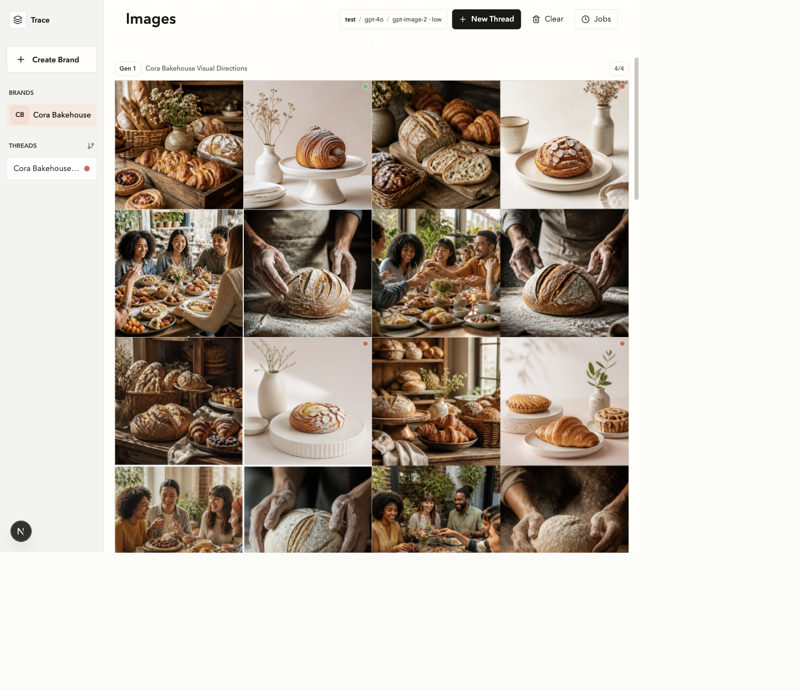


### Clear demo state

Clicked the visible Clear action to start from an empty local state.


### Open brand wizard

Opened Create Brand. Brand inputs: {"name":"Cora Bakehouse","category":"bakery","goal":"product imagery","audience":"neighborhood brunch customers"}. Tone and avoid notes intentionally left blank.


### Fill brief brand profile

Entered name, category, goal, and audience only. No tone chips or avoid notes.

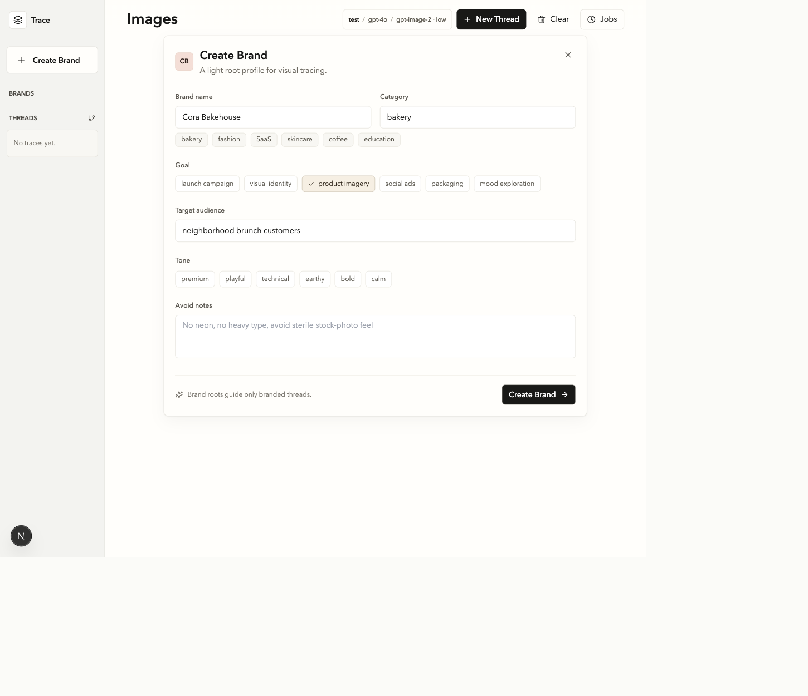


### Create brand

Submitted the brand wizard.


### Start first exploration

Started the first generation thread for this brand.


### Generation ready: turn 1 ready

Detected 4 ready image like controls; expected at least 4.

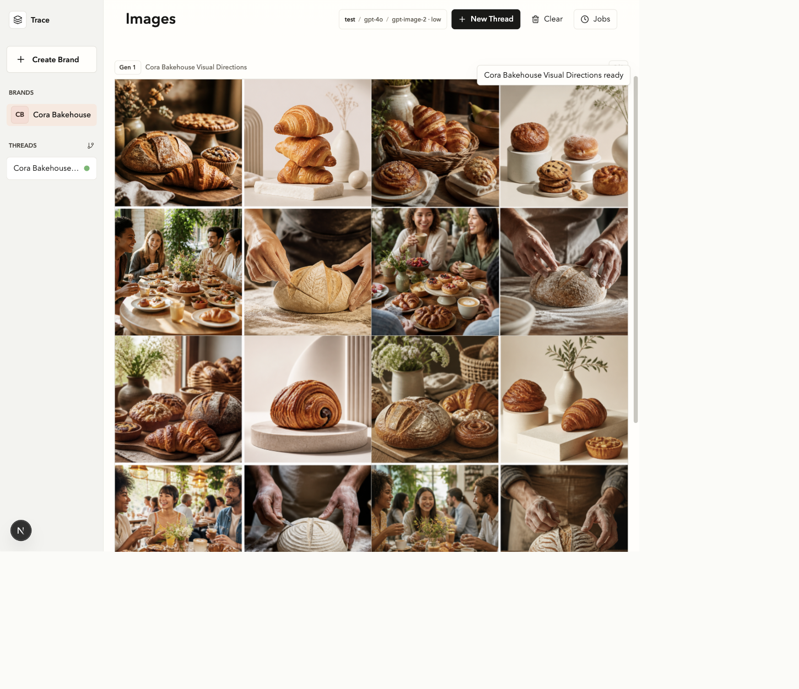


### Turn 1 ready

System showed four generated images.


### React Like to Image 1

Clicked Like for Image 1.


### Turn 1 reaction

Liked Image 1.


### React Dislike to Image 2

Clicked Dislike for Image 2.


### Turn 1 reaction

Disliked Image 2.

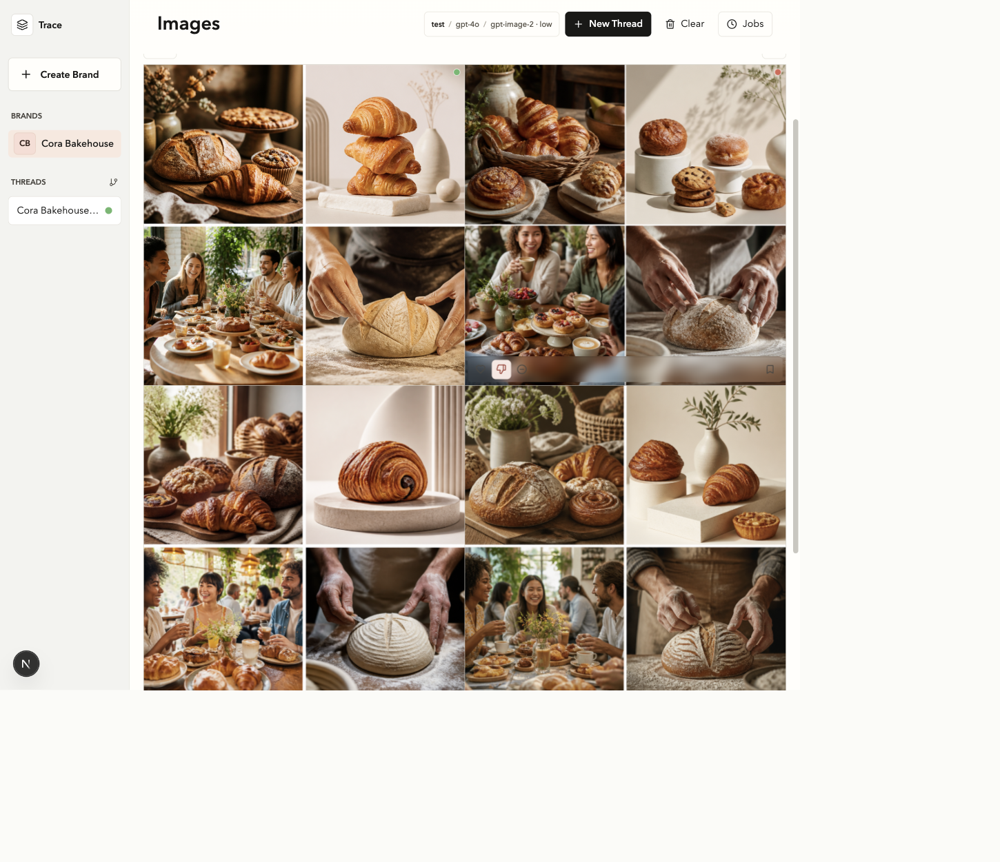


### React Dislike to Image 3

Clicked Dislike for Image 3.

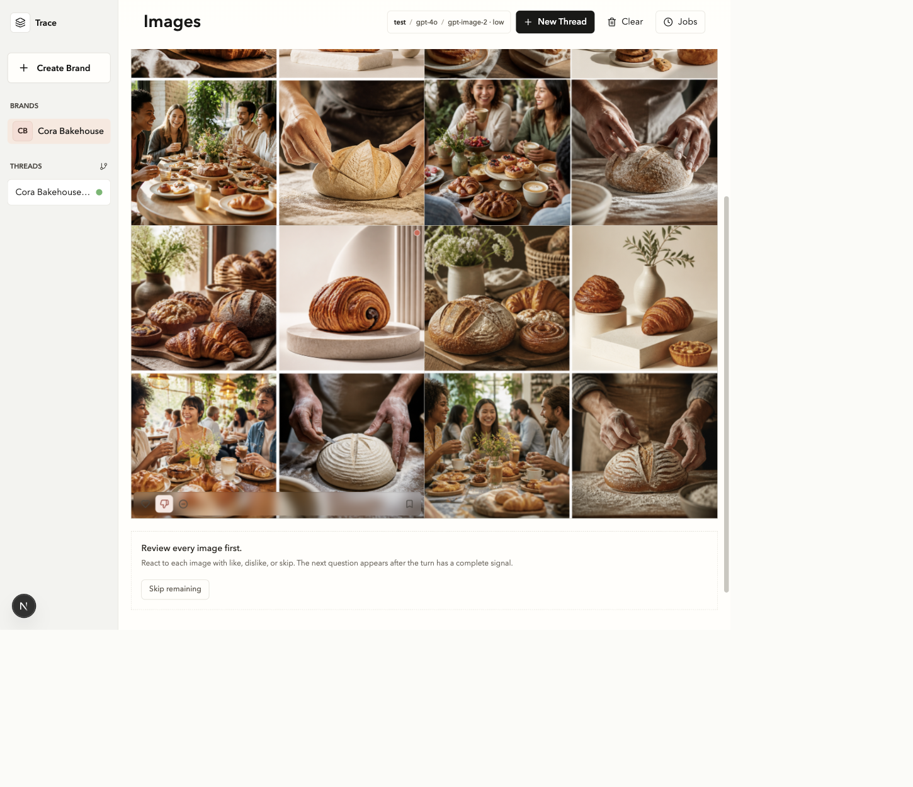


### Turn 1 reaction

Disliked Image 3.


### React Dislike to Image 4

Clicked Dislike for Image 4.


### Turn 1 reaction

Disliked Image 4.


### Question shown

Observed question panel.

```
- complementary:
  - generic: Trace
  - button "Create Brand":
    - generic: Create Brand
  - generic: Brands
  - generic: CB
  - generic: Cora Bakehouse
  - text: Threads
  - button "Cora Bakehouse Directions":
    - generic: Cora Bakehouse Directions
- main:
  - heading "Images" [level=1]
  - generic "Change OPENAI_DEMO_PROFILE in .env to switch between test and custom settings":
    - generic: test
    - generic: /
    - generic: gpt-4o
    - generic: /
    - generic: gpt-image-2 · low
  - button "New Thread":
    - text: New Thread
  - button "Clear":
    - text: Clear
  - button "Jobs":
    - text: Jobs
  - generic "Cora Bakehouse Directions":
    - generic: CB
    - paragraph: Cora Bakehouse
    - paragraph: bakery · product imagery
  - article:
    - generic: Gen 1
    - generic: Cora Bakehouse Visual Directions
    - generic: 4/4
    - button "Image 1":
      - img "Image 1"
    - button "Like":
    - button "Dislike":
    - button "Skip":
    - button "Use as reference":
    - button "Image 2":
      - img "Image 2"
    - button "Like":
    - button "Dislike":
    - button "Skip":
    - button "Use as reference":
    - button "Image 3":
      - img "Image 3"
    - button "Like":
    - button "Dislike":
    - button "Skip":
    - button "Use as reference":
    - button "Image 4":
      - img "Image 4"
    - button "Like":
    - button "Dislike" [active]:
    - button "Skip":
    - button "Use as reference":
  - complementary:
    - text: Next question
    - generic: 1/3
    - paragraph: Why did you dislike Image 2?
    - button "lacks warmth"
    - button "too minimal"
    - button "missing rustic elements"
    - button "palette too clean for brand"
    - generic: Answer this before the next question.
    - button "Next question" [disabled]:
      - text: Next question
- button "Open Next
```


### Turn 1 follow-up question

- complementary:
  - generic: Trace
  - button "Create Brand":
    - generic: Create Brand
  - generic: Brands
  - generic: CB
  - generic: Cora Bakehouse
  - text: Threads
  - button "Cora Bakehouse Directions":
    - generic: Cora Bakehouse Directions
- main:
  - heading "Images" [level=1]
  - generic "Change OPENAI_DEMO_PROFILE in .env to switch between test and custom settings":
    - generic: test
    - generic: /
    - generic: gpt-4o
    - generic: /
    - generic: gpt-image-2 · low
  - button "New Thread":
    - text: New Thread
  - button "Clear":
    - text: Clear
  - button "Jobs":
    - text: Jobs
  - generic "Cora Bakehouse Directions":
    - generic: CB
    - paragraph: Cora Bakehouse
    - paragraph: bakery · product imagery
  - article:
    - generic: Gen 1
    - generic: Cora Bakehouse Visual Directions
    - generic: 4/4
    - button "Image 1":
      - img "Image 1"
    - button "Like":
    - button "Dislike":
    - button "Skip":
    - button "Use as reference":
    - button "Image 2":
      - img "Image 2"
    - button "Like":
    - button "Dislike":
    - button "Skip":
    - button "Use as reference":
    - button "Image 3":
      - img "Image 3"
    - button "Like":
    - button "Dislike":
    - button "Skip":
    - button "Use as reference":
    - button "Image 4":
      - img "Image 4"
    - button "Like":
    - button "Dislike" [active]:
    - button "Skip":
    - button "Use as reference":
  - complementary:
    - text: Next question
    - generic: 1/3
    - paragraph: Why did you dislike Image 2?
    - button "lacks warmth"
    - button "too minimal"
    - button "missing rustic elements"
    - button "palette too clean for brand"
    - generic: Answer this before the next question.
    - button "Next question" [disabled]:
      - text: Next question
- button "Open Next.js Dev Tools":
- alert


## Scenario 1 Rerun After Feedback Fix

Persona: Mira, local bakery owner testing breakfast launch product imagery. Brand: Mira Crust; category: bakery; goal: product imagery; audience: office commuters. Tone and avoid notes left blank.

### Before interaction

Fresh reload before starting the scenario.

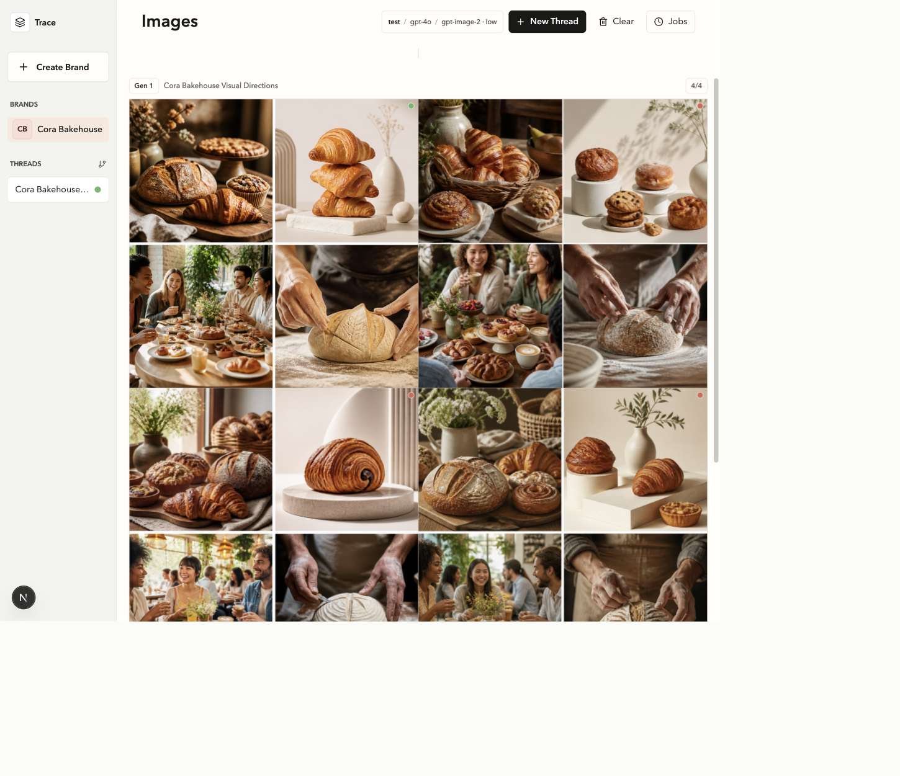


### Clear demo state

Clicked the visible Clear action to start from an empty local state.


### Open brand wizard

Opened Create Brand. Brand inputs: {"name":"Mira Crust","category":"bakery","goal":"product imagery","audience":"office commuters"}. Tone and avoid notes intentionally left blank.


### Fill brief brand profile

Entered name, category, goal, and audience only. No tone chips or avoid notes.


### Create brand

Submitted the brand wizard.


### Start first exploration

Started the first generation thread for this brand.


### Generation ready: s1 rerun turn 1 ready

Detected 4 ready image like controls; expected at least 4.


### Turn 1 ready

System showed four generated images after the feedback merge fix.

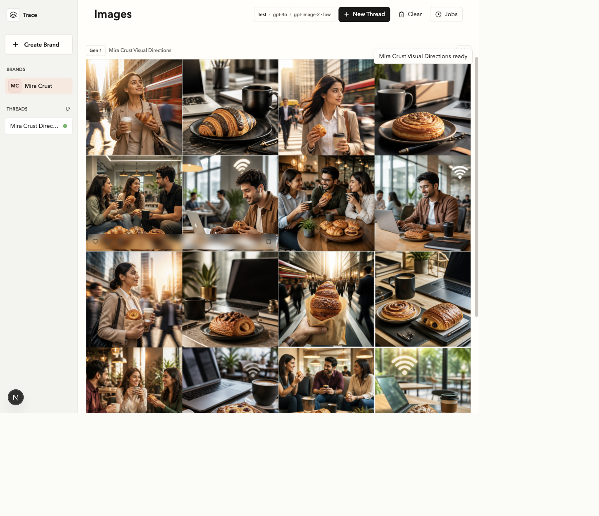


### React Like to Image 1

Clicked Like for Image 1.


### Turn 1 reaction

Liked Image 1.


### React Dislike to Image 2

Clicked Dislike for Image 2.

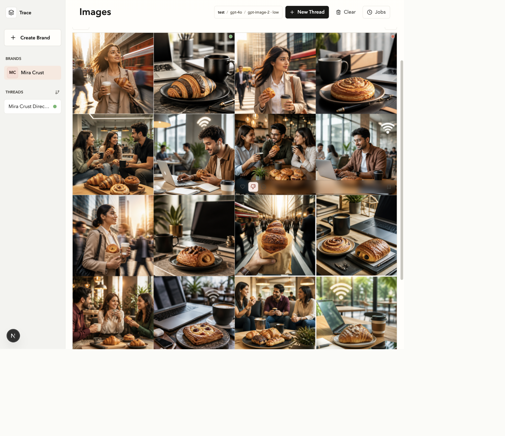


### Turn 1 reaction

Disliked Image 2.


### React Dislike to Image 3

Clicked Dislike for Image 3.


### Turn 1 reaction

Disliked Image 3.

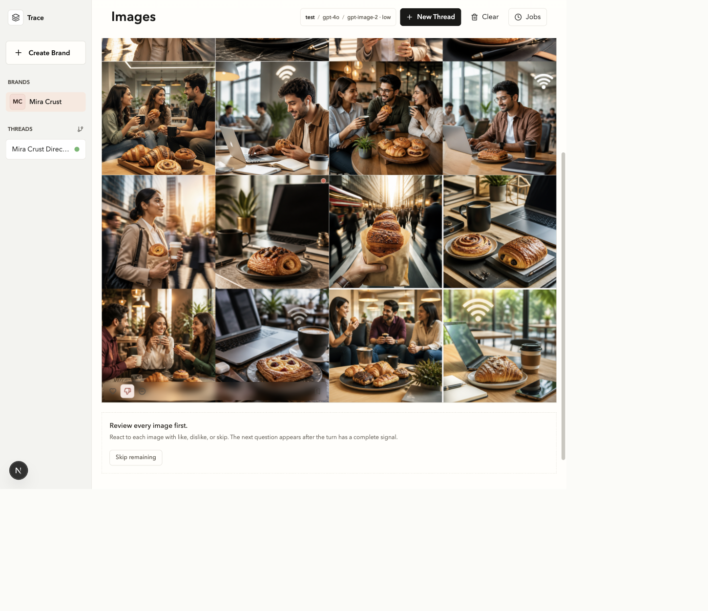


### React Dislike to Image 4

Clicked Dislike for Image 4.

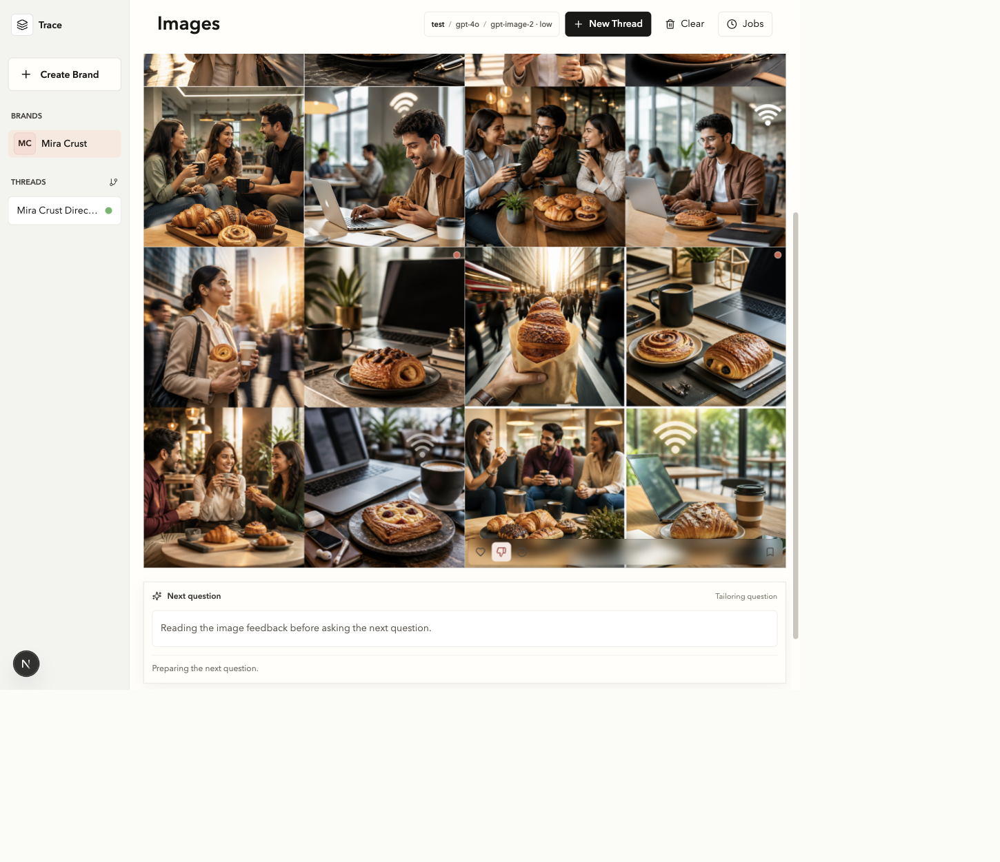


### Turn 1 reaction

Disliked Image 4.


### Question shown

Observed question panel.

```
- complementary:
  - generic: Trace
  - button "Create Brand":
    - generic: Create Brand
  - generic: Brands
  - generic: MC
  - generic: Mira Crust
  - text: Threads
  - button "Mira Crust Directions":
    - generic: Mira Crust Directions
- main:
  - heading "Images" [level=1]
  - generic "Change OPENAI_DEMO_PROFILE in .env to switch between test and custom settings":
    - generic: test
    - generic: /
    - generic: gpt-4o
    - generic: /
    - generic: gpt-image-2 · low
  - button "New Thread":
    - text: New Thread
  - button "Clear":
    - text: Clear
  - button "Jobs":
    - text: Jobs
  - generic "Mira Crust Directions":
    - generic: MC
    - paragraph: Mira Crust
    - paragraph: bakery · product imagery
  - article:
    - generic: Gen 1
    - generic: Mira Crust Visual Directions
    - generic: 4/4
    - button "Image 1":
      - img "Image 1"
    - button "Like":
    - button "Dislike":
    - button "Skip":
    - button "Use as reference":
    - button "Image 2":
      - img "Image 2"
    - button "Like":
    - button "Dislike":
    - button "Skip":
    - button "Use as reference":
    - button "Image 3":
      - img "Image 3"
    - button "Like":
    - button "Dislike":
    - button "Skip":
    - button "Use as reference":
    - button "Image 4":
      - img "Image 4"
    - button "Like":
    - button "Dislike" [active]:
    - button "Skip":
    - button "Use as reference":
  - complementary:
    - text: Next question
    - paragraph: What should we keep from Image 1 and avoid from the others?
    - button "warm morning bakery feel"
    - button "fresh-baked texture"
    - button "croissant as hero"
    - button "cozy local bakery mood"
    - button "simple social-post layout"
    - button "too polished"
    - button "too dark"
    - button "not breakfast-focused"
    - button "too childish"
    - button "missing fresh-baked texture"
    - textbox "Optional steer, e.g. remove text and make the background warmer"
    - text: "Next generation:"
    - generic: refine · 1 image
    - button "Generate 1 image" [disabled]:
      - text: Generate 1 image
- button "Open Next
```


### Turn 1 follow-up question

What should we keep from Image 1 and avoid from the others?


### Answer feedback option

Selected option: warm morning bakery feel


### Turn 1 feedback answer

Selected the first contextual reason chip for what to keep/avoid.

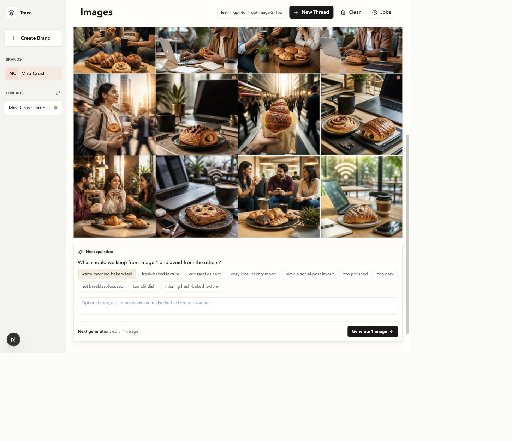


### Generate next turn

Clicked Generate 1 image.


### Generate Turn 2

Clicked Generate 1 image after answering the keep/avoid question.

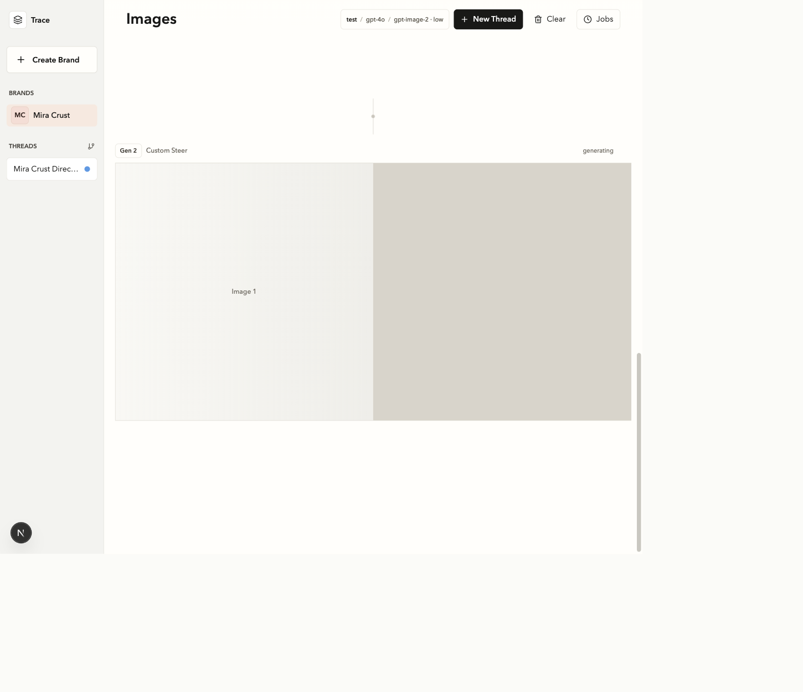


### Generation ready: s1 rerun turn 2 ready

Detected 4 ready image like controls; expected at least 1.


### Turn 2 ready

One refined image appeared below the first turn.

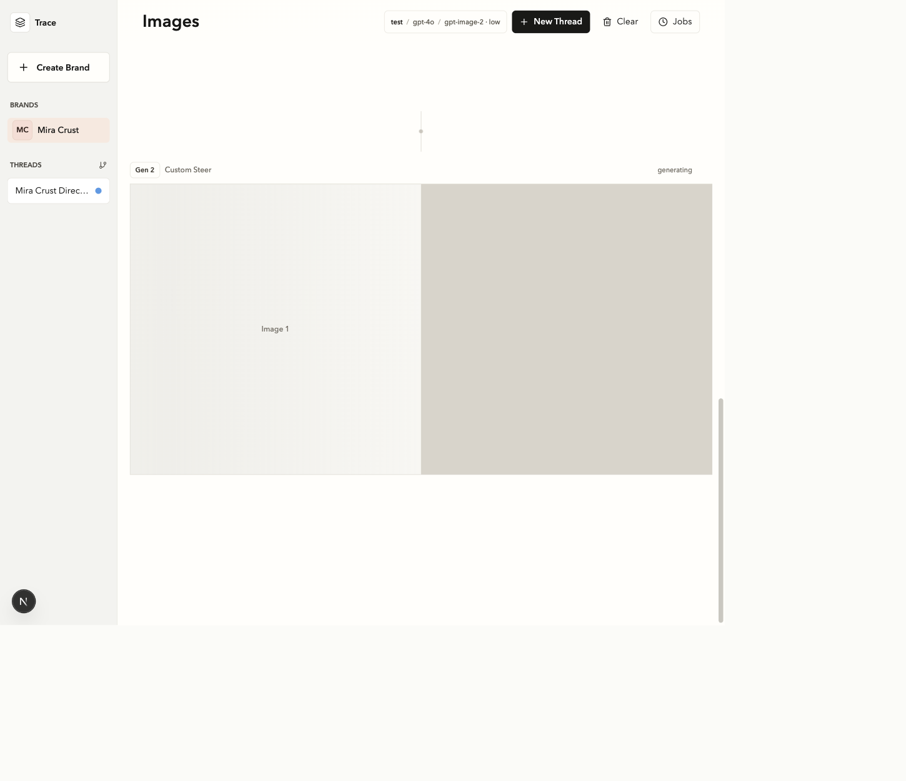


### Bug found - image model created grids inside grid cells

Observed that some returned images contained their own multi-panel/grid composition. Cause: the batch prompt asked for multiple directions in one request without sufficiently saying each API output must be one standalone full-canvas image. Fix applied in lib/ai/images/socialPrompt.ts: each returned file is now explicitly one full-bleed square asset, never a contact sheet, collage, 2x2 grid, four-panel layout, or split-screen comparison. Added tests/imagePrompt.test.ts to guard this wording.


## Scenario 1 Post Nested-Grid Fix

Persona: Nia, bakery owner testing single-image social assets after the nested-grid prompt fix. Brand: Nia Oven; category: bakery; goal: product imagery; audience: office commuters. Tone and avoid notes left blank.

### Before interaction

Fresh reload before starting the scenario.


### Clear demo state

Clicked the visible Clear action to start from an empty local state.

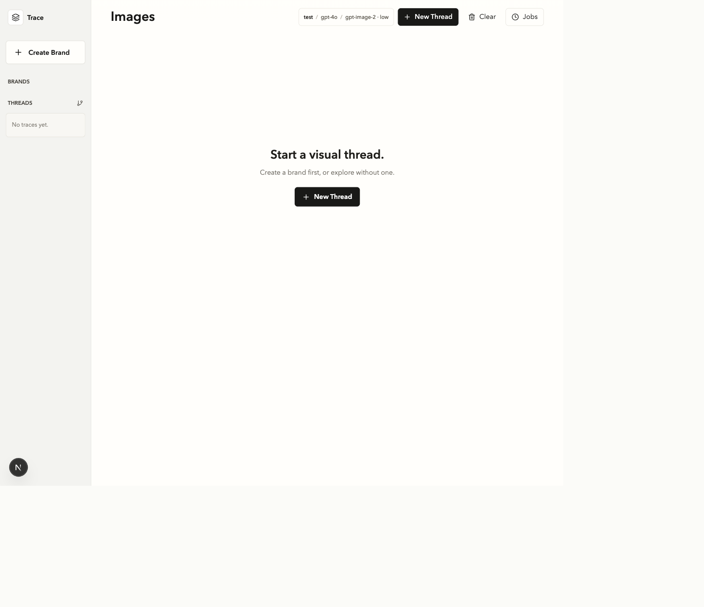


### Open brand wizard

Opened Create Brand. Brand inputs: {"name":"Nia Oven","category":"bakery","goal":"product imagery","audience":"office commuters"}. Tone and avoid notes intentionally left blank.


### Fill brief brand profile

Entered name, category, goal, and audience only. No tone chips or avoid notes.

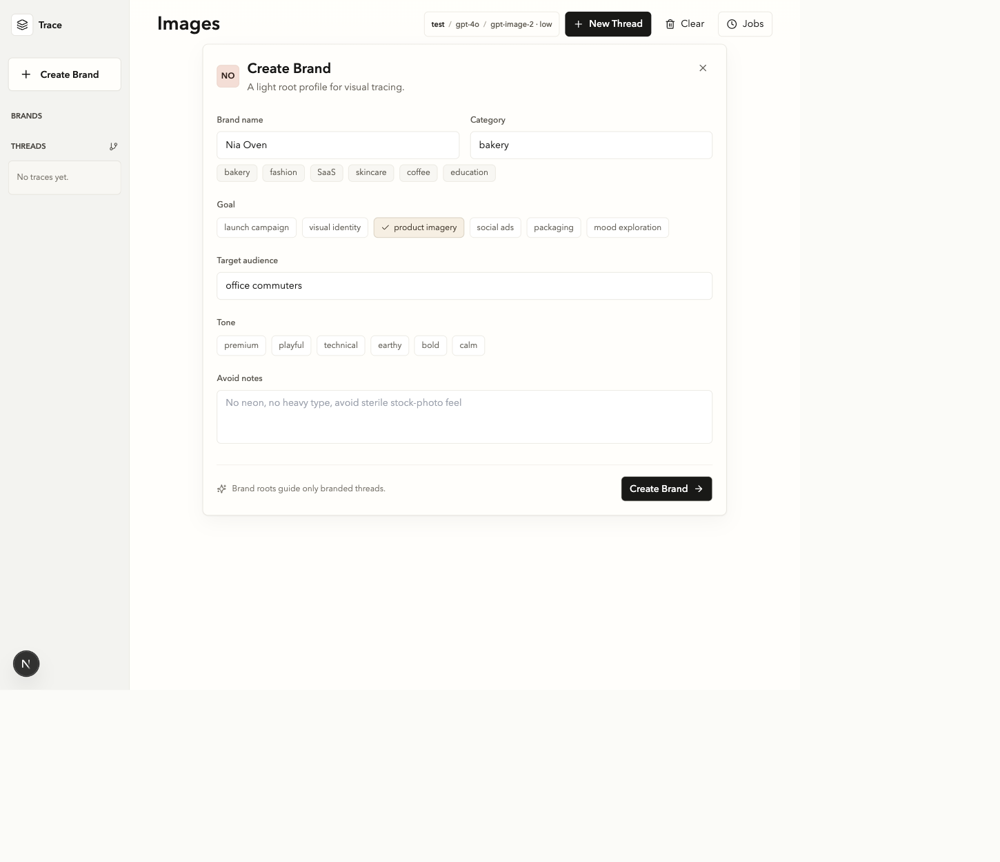


### Create brand

Submitted the brand wizard.

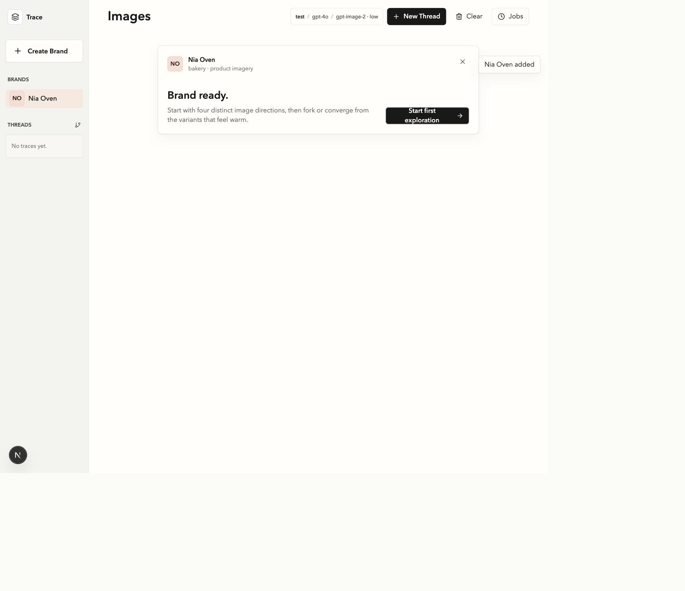


### Start first exploration

Started the first generation thread for this brand.


### Generation ready: s1 post fix turn 1 ready

Detected 4 ready image like controls; expected at least 4.

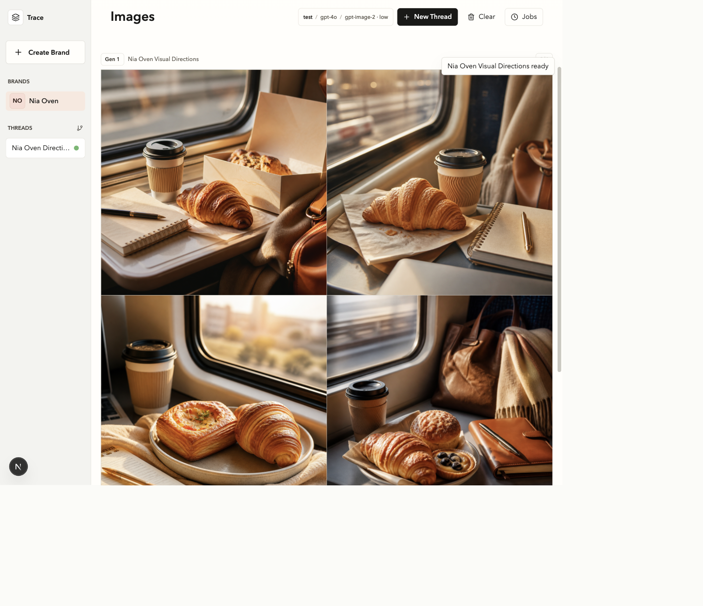


### Turn 1 ready after nested-grid fix

System generated four separate API outputs. Visually check that each cell is one asset rather than a 2x2 composition inside the cell.

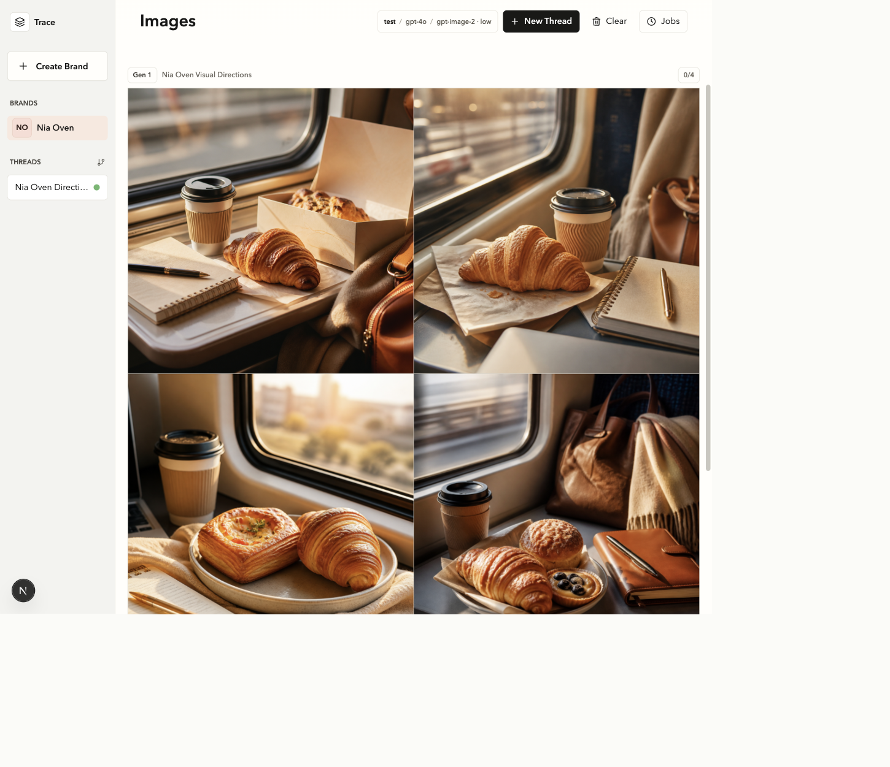


### Nested-grid fix verification

Post-fix generation shows the outer app review grid only. Each returned image cell is a single full-bleed asset rather than a grid inside the image.


### React Like to Image 1

Clicked Like for Image 1.


### Turn 1 reaction

Liked Image 1.

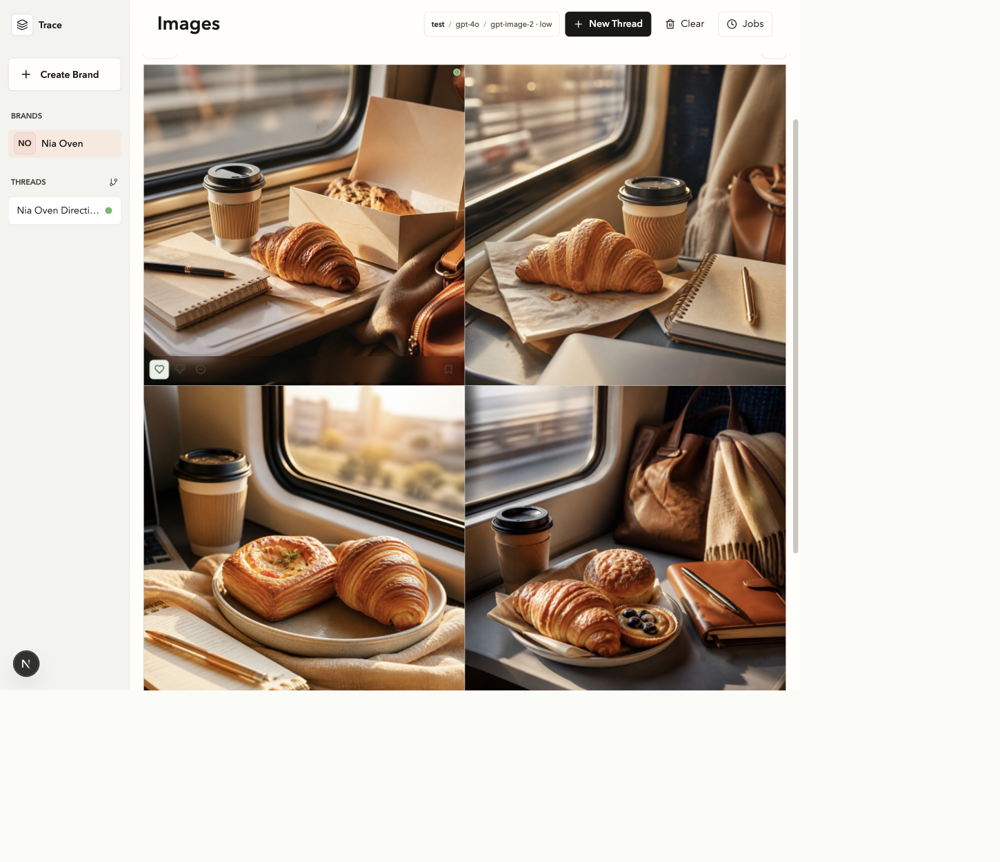


### React Dislike to Image 2

Clicked Dislike for Image 2.

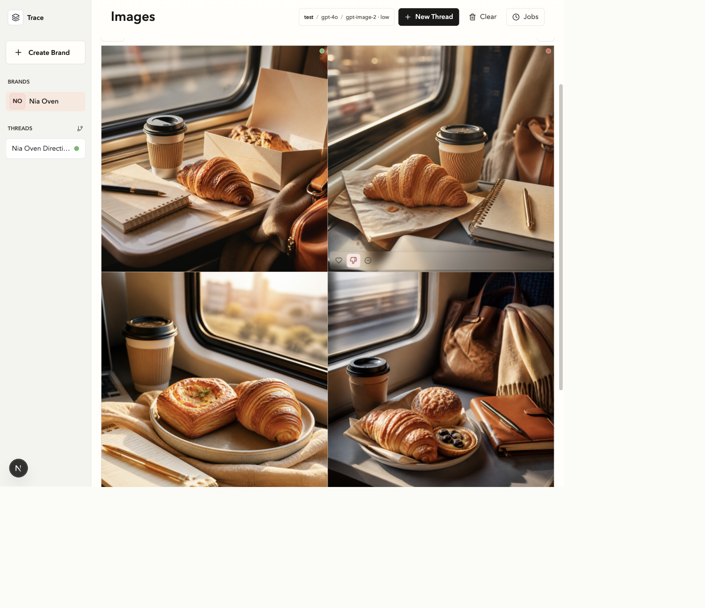


### Turn 1 reaction

Disliked Image 2.


### React Dislike to Image 3

Clicked Dislike for Image 3.

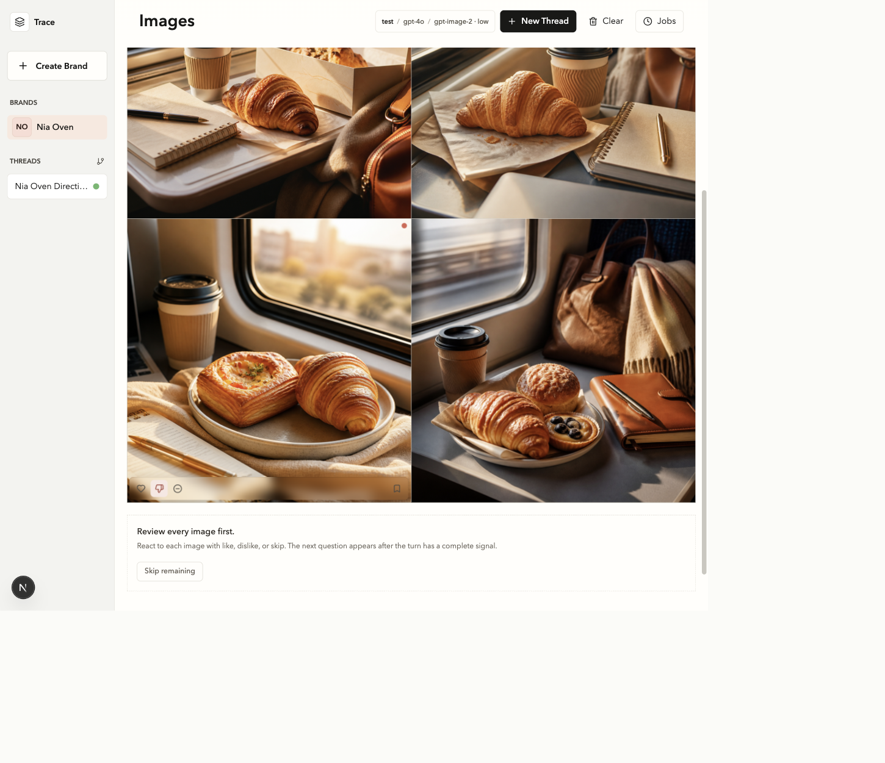


### Turn 1 reaction

Disliked Image 3.


### React Dislike to Image 4

Clicked Dislike for Image 4.


### Turn 1 reaction

Disliked Image 4.


### Question shown

Observed question panel.

```
- complementary:
  - generic: Trace
  - button "Create Brand":
    - generic: Create Brand
  - generic: Brands
  - generic: "NO"
  - generic: Nia Oven
  - text: Threads
  - button "Nia Oven Directions":
    - generic: Nia Oven Directions
- main:
  - heading "Images" [level=1]
  - generic "Change OPENAI_DEMO_PROFILE in .env to switch between test and custom settings":
    - generic: test
    - generic: /
    - generic: gpt-4o
    - generic: /
    - generic: gpt-image-2 · low
  - button "New Thread":
    - text: New Thread
  - button "Clear":
    - text: Clear
  - button "Jobs":
    - text: Jobs
  - generic "Nia Oven Directions":
    - generic: "NO"
    - paragraph: Nia Oven
    - paragraph: bakery · product imagery
  - article:
    - generic: Gen 1
    - generic: Nia Oven Visual Directions
    - generic: 4/4
    - button "Image 1":
      - img "Image 1"
    - button "Like":
    - button "Dislike":
    - button "Skip":
    - button "Use as reference":
    - button "Image 2":
      - img "Image 2"
    - button "Like":
    - button "Dislike":
    - button "Skip":
    - button "Use as reference":
    - button "Image 3":
      - img "Image 3"
    - button "Like":
    - button "Dislike":
    - button "Skip":
    - button "Use as reference":
    - button "Image 4":
      - img "Image 4"
    - button "Like":
    - button "Dislike" [active]:
    - button "Skip":
    - button "Use as reference":
  - complementary:
    - text: Next question
    - paragraph: What should we keep from Image 1 and avoid from the others?
    - button "warm morning bakery feel"
    - button "fresh-baked texture"
    - button "croissant as hero"
    - button "cozy local bakery mood"
    - button "simple social-post layout"
    - button "too polished"
    - button "too dark"
    - button "not breakfast-focused"
    - button "too childish"
    - button "missing fresh-baked texture"
    - textbox "Optional steer, e.g. remove text and make the background warmer"
    - text: "Next generation:"
    - generic: refine · 1 image
    - button "Generate 1 image" [disabled]:
      - text: Generate 1 image
- button "Open Next
```


### Turn 1 follow-up question

What should we keep from Image 1 and avoid from the others?


### Answer feedback option

Selected option: warm morning bakery feel


### Turn 1 answer

Selected the first contextual chip.

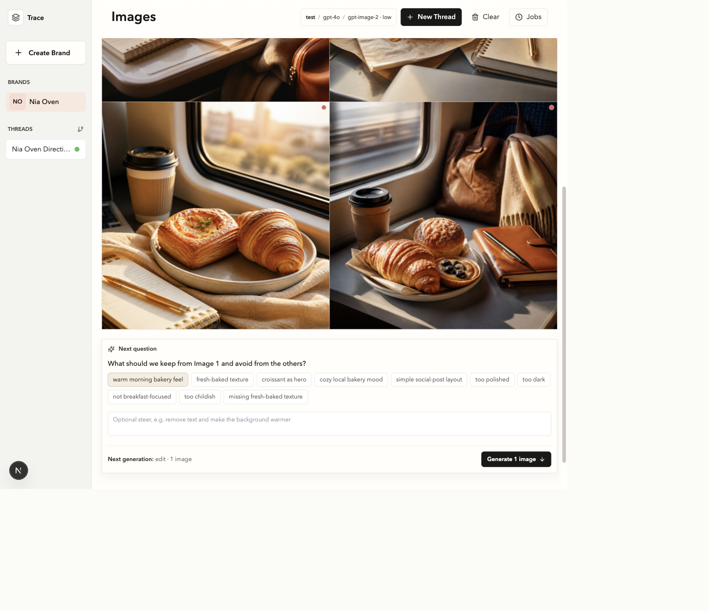


### Generate next turn

Clicked Generate 1 image.


### Generate Turn 2

Clicked Generate 1 image.


### Generation ready: s1 post fix turn2 ready

Detected 4 ready image like controls; expected at least 1.

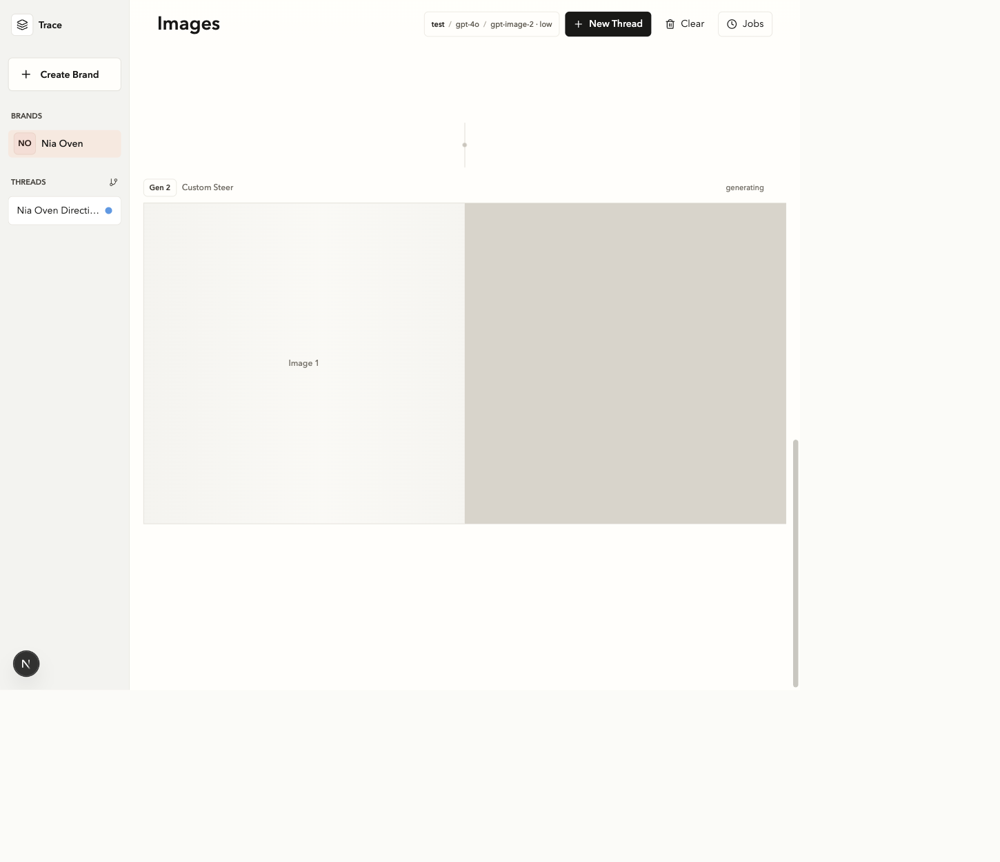


### Turn 2 ready

One refined image appeared below the first turn.


### Bug found - refinement exceeded context window

After selecting keep/avoid and generating one refined image, the API returned a context-window error. Cause: any liked parent image was automatically sent as an image edit/reference input. Fix applied in components/generation/runNode.ts: continuation nodes now use liked images as text memory by default, and only send image files when explicitly marked as references or used for convergence.


## Scenario 1 Final Rerun After Reference Fix

Persona: Owen, bakery owner reviewing commuter breakfast visuals. Brand: Owen Bake; category: bakery; goal: product imagery; audience: office commuters. Tone and avoid notes left blank.

### Before interaction

Fresh reload before starting the scenario.

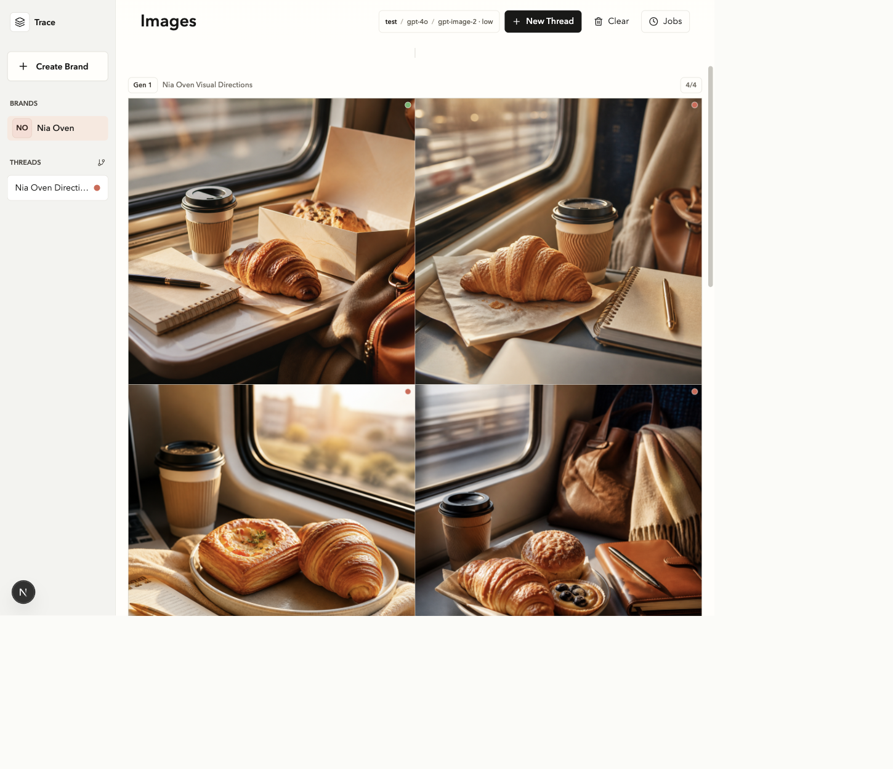


### Clear demo state

Clicked the visible Clear action to start from an empty local state.


### Open brand wizard

Opened Create Brand. Brand inputs: {"name":"Owen Bake","category":"bakery","goal":"product imagery","audience":"office commuters"}. Tone and avoid notes intentionally left blank.


### Fill brief brand profile

Entered name, category, goal, and audience only. No tone chips or avoid notes.


### Create brand

Submitted the brand wizard.


### Start first exploration

Started the first generation thread for this brand.

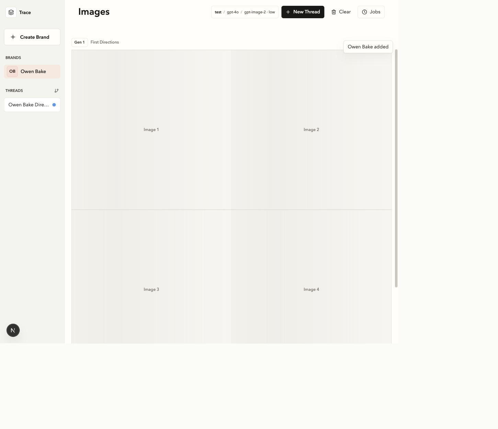


### Generation ready: s1 final turn 1 ready

Detected 4 ready image like controls; expected at least 4.

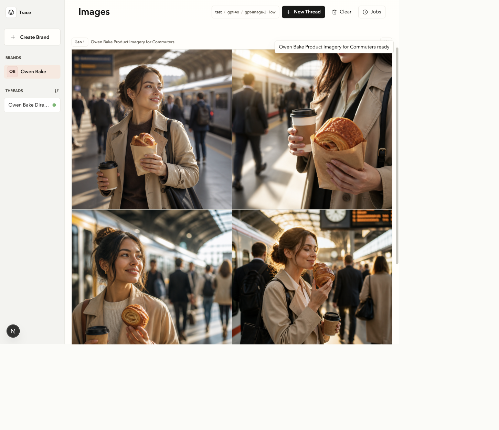


### Turn 1 ready

Four full-bleed image assets generated; no nested grids in the generated images.


### React Like to Image 1

Clicked Like for Image 1.


### Turn 1 reaction

Liked Image 1.


### React Dislike to Image 2

Clicked Dislike for Image 2.

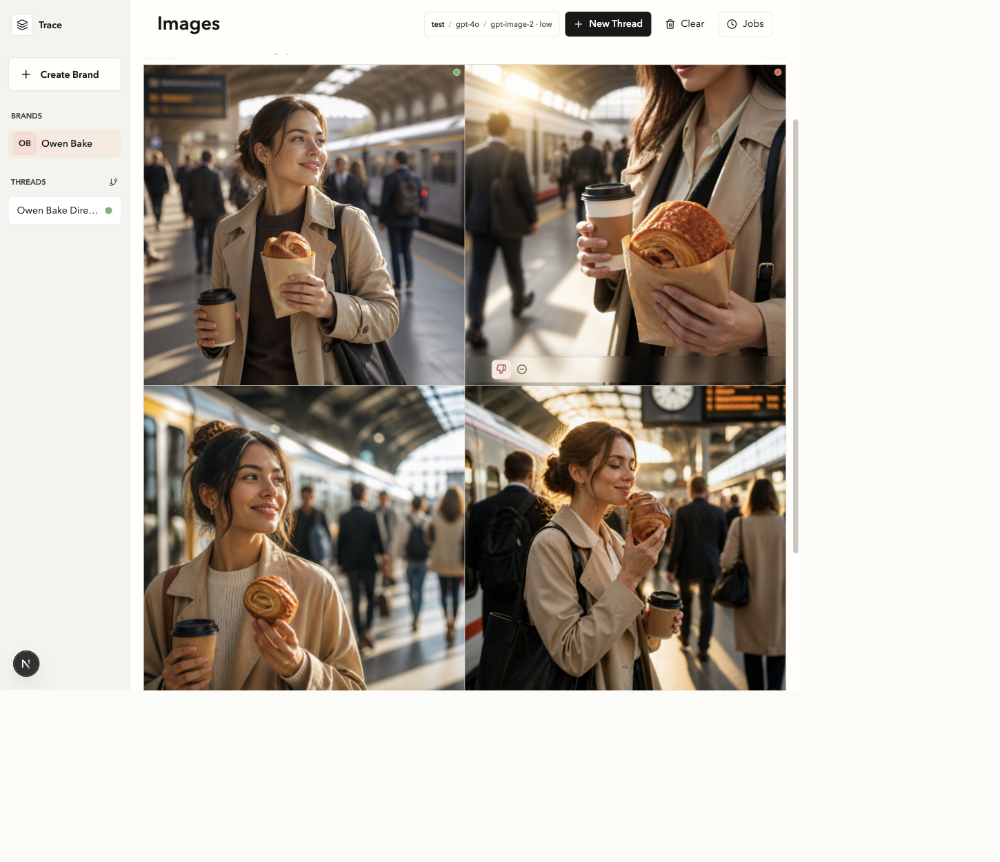


### Turn 1 reaction

Disliked Image 2.


### React Dislike to Image 3

Clicked Dislike for Image 3.


### Turn 1 reaction

Disliked Image 3.


### React Dislike to Image 4

Clicked Dislike for Image 4.

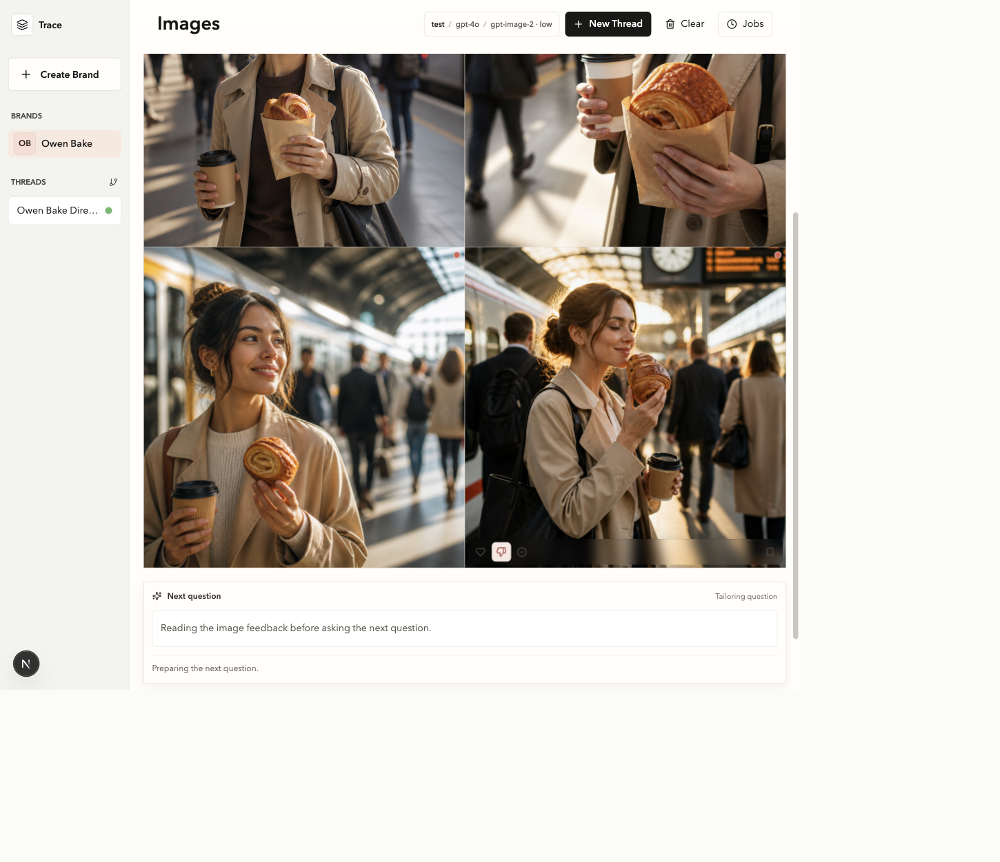


### Turn 1 reaction

Disliked Image 4.


### Question shown

Observed question panel.

```
- complementary:
  - generic: Trace
  - button "Create Brand":
    - generic: Create Brand
  - generic: Brands
  - generic: OB
  - generic: Owen Bake
  - text: Threads
  - button "Owen Bake Directions":
    - generic: Owen Bake Directions
- main:
  - heading "Images" [level=1]
  - generic "Change OPENAI_DEMO_PROFILE in .env to switch between test and custom settings":
    - generic: test
    - generic: /
    - generic: gpt-4o
    - generic: /
    - generic: gpt-image-2 · low
  - button "New Thread":
    - text: New Thread
  - button "Clear":
    - text: Clear
  - button "Jobs":
    - text: Jobs
  - generic "Owen Bake Directions":
    - generic: OB
    - paragraph: Owen Bake
    - paragraph: bakery · product imagery
  - article:
    - generic: Gen 1
    - generic: Owen Bake Product Imagery for Commuters
    - generic: 4/4
    - button "Image 1":
      - img "Image 1"
    - button "Like":
    - button "Dislike":
    - button "Skip":
    - button "Use as reference":
    - button "Image 2":
      - img "Image 2"
    - button "Like":
    - button "Dislike":
    - button "Skip":
    - button "Use as reference":
    - button "Image 3":
      - img "Image 3"
    - button "Like":
    - button "Dislike":
    - button "Skip":
    - button "Use as reference":
    - button "Image 4":
      - img "Image 4"
    - button "Like":
    - button "Dislike" [active]:
    - button "Skip":
    - button "Use as reference":
  - complementary:
    - text: Next question
    - paragraph: What should we keep from Image 1 and avoid from the others?
    - button "warm morning bakery feel"
    - button "fresh-baked texture"
    - button "croissant as hero"
    - button "cozy local bakery mood"
    - button "simple social-post layout"
    - button "too polished"
    - button "too dark"
    - button "not breakfast-focused"
    - button "too childish"
    - button "missing fresh-baked texture"
    - textbox "Optional steer, e.g. remove text and make the background warmer"
    - text: "Next generation:"
    - generic: refine · 1 image
    - button "Generate 1 image" [disabled]:
      - text: Generate 1 image
- button "Open Next
```


### Turn 1 follow-up question

Expected: What should we keep from Image 1 and avoid from the others? Actual question captured in screenshot.

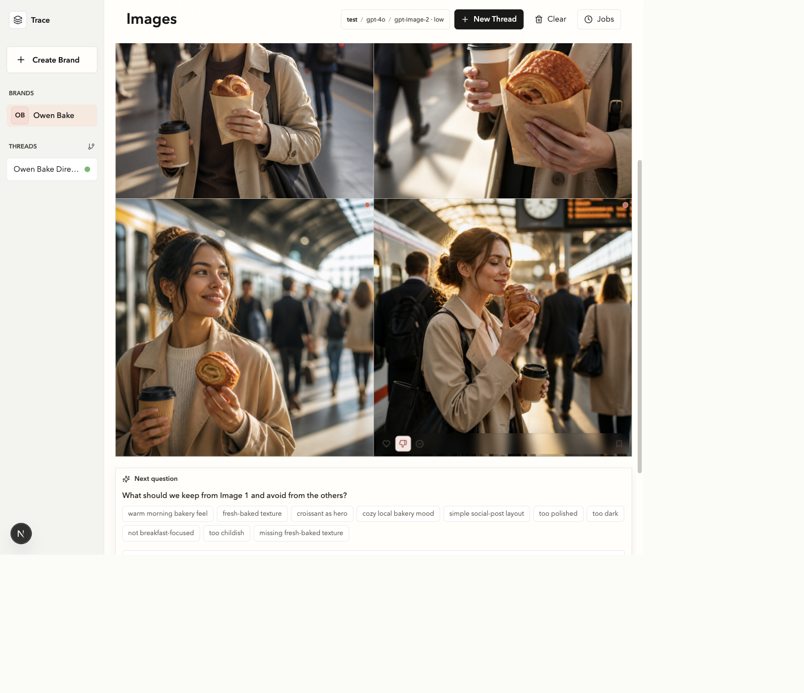


### Answer feedback option

Selected option: warm morning bakery feel


### Turn 1 answer

Selected the first contextual reason chip.

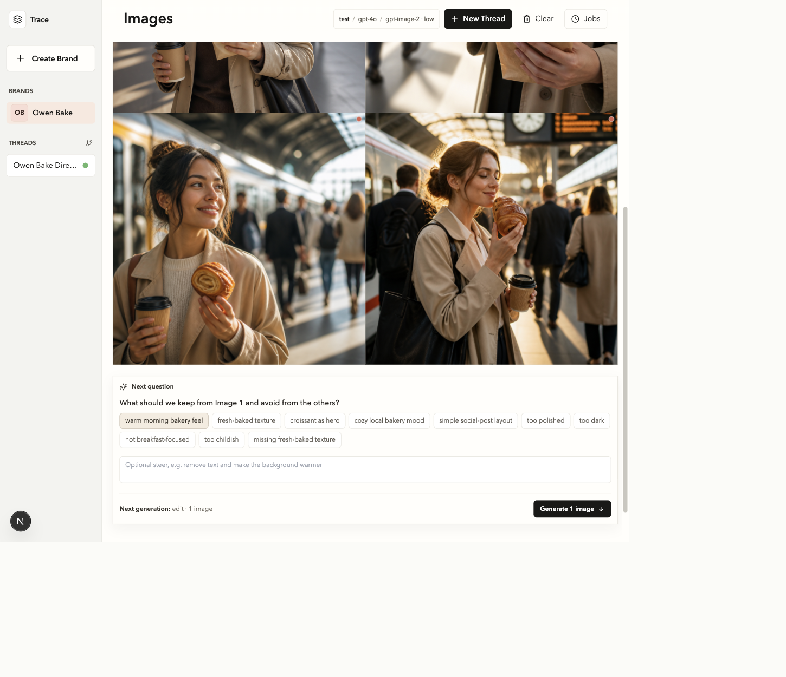


### Generate next turn

Clicked Generate 1 image.


### Generate Turn 2

Clicked Generate 1 image.


### Retest note - stale client bundle still failed

The first retest after patch still hit the context-window error, likely because the active browser tab had not reloaded the patched client-side reference filtering code. Reloading and clearing before the next retest.

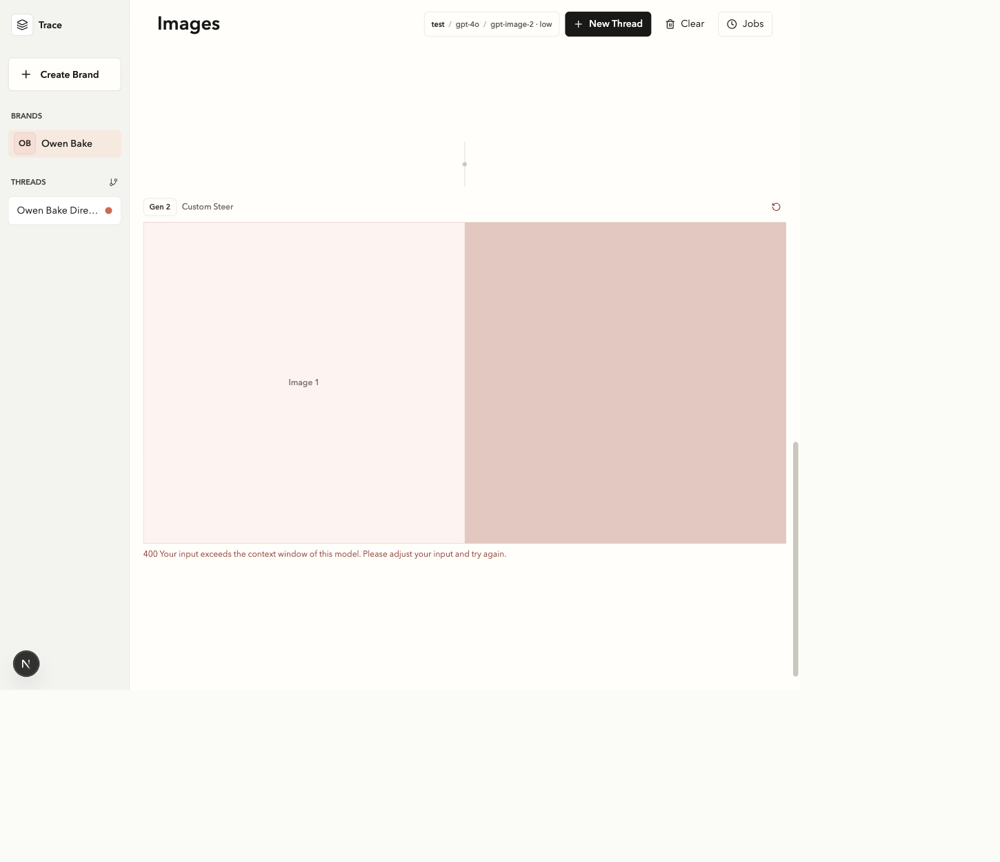


## Scenario 1 Hard-Reload Retest

Persona: Rae, bakery owner reviewing commuter breakfast visuals after a hard reload. Brand: Rae Bakes; category: bakery; goal: product imagery; audience: office commuters. Tone and avoid notes left blank.

### Hard reload

Reloaded the app so patched client-side reference filtering is active.


### Before interaction

Fresh reload before starting the scenario.

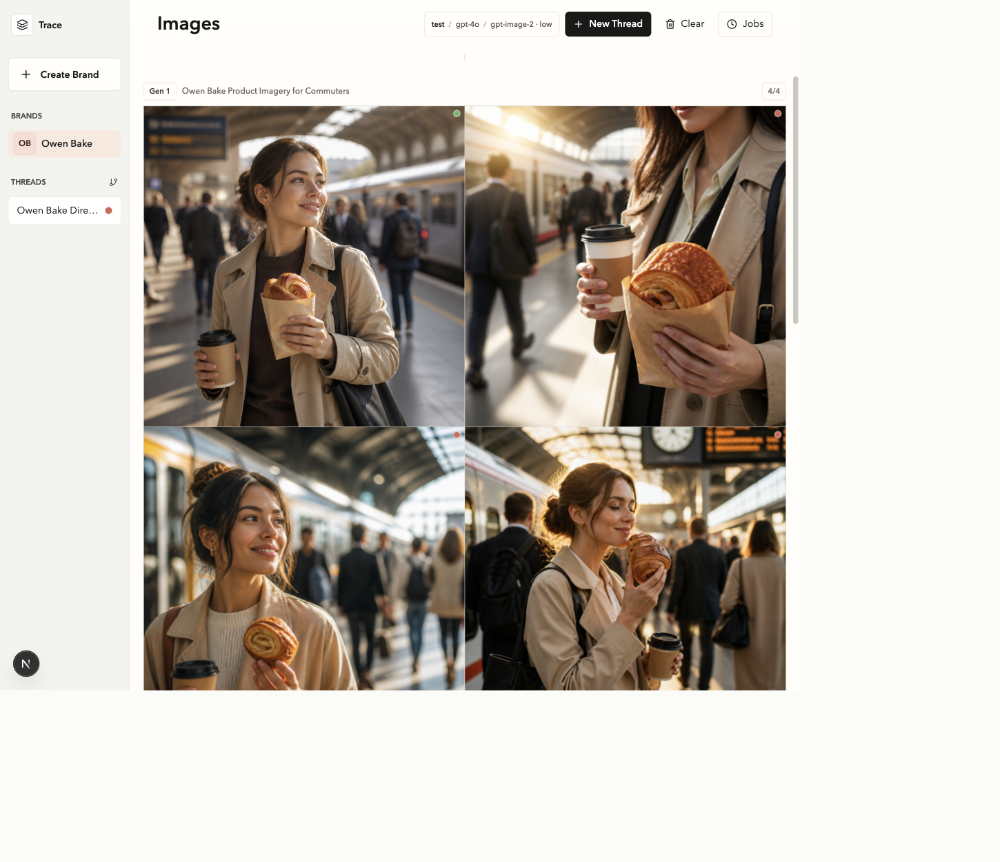


### Clear demo state

Clicked the visible Clear action to start from an empty local state.


### Open brand wizard

Opened Create Brand. Brand inputs: {"name":"Rae Bakes","category":"bakery","goal":"product imagery","audience":"office commuters"}. Tone and avoid notes intentionally left blank.


### Fill brief brand profile

Entered name, category, goal, and audience only. No tone chips or avoid notes.


### Create brand

Submitted the brand wizard.


### Start first exploration

Started the first generation thread for this brand.


### Generation ready: s1 hard reload turn1 ready

Detected 4 ready image like controls; expected at least 4.


### Turn 1 ready

Four single full-bleed image assets generated.

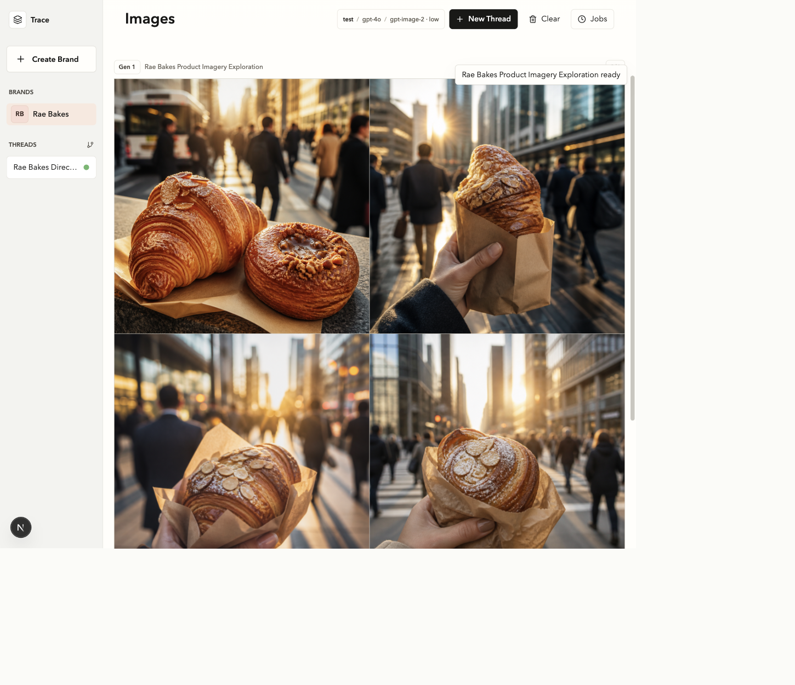


### React Like to Image 1

Clicked Like for Image 1.


### Turn 1 reaction

Liked Image 1.

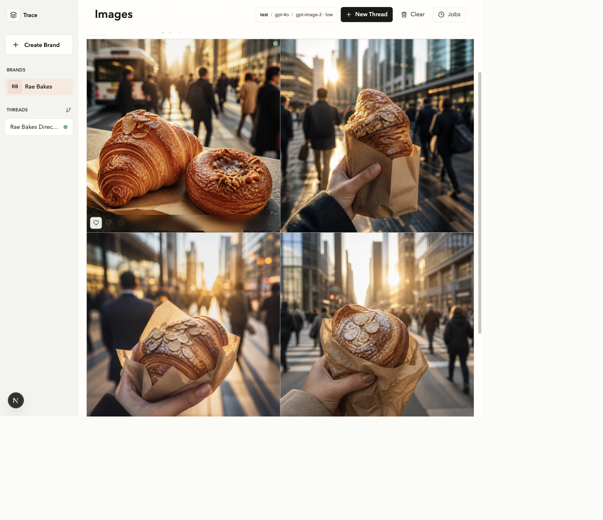


### React Dislike to Image 2

Clicked Dislike for Image 2.


### Turn 1 reaction

Disliked Image 2.


### React Dislike to Image 3

Clicked Dislike for Image 3.

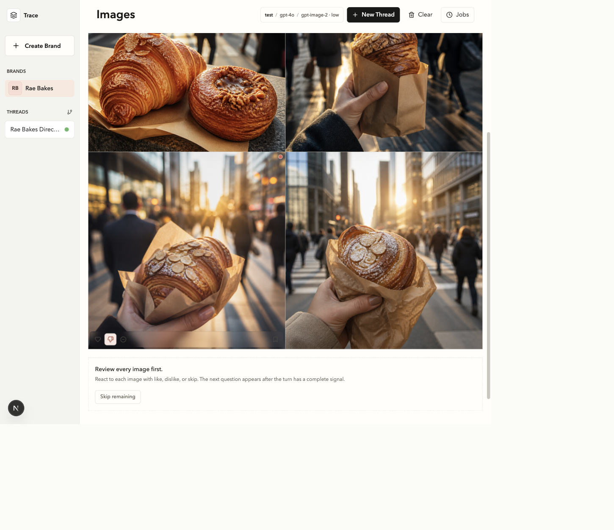


### Turn 1 reaction

Disliked Image 3.


### React Dislike to Image 4

Clicked Dislike for Image 4.

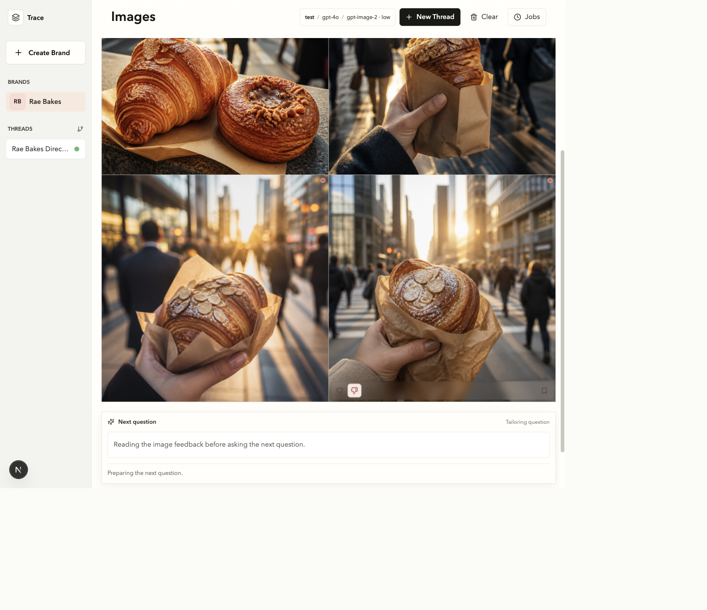


### Turn 1 reaction

Disliked Image 4.


### Question shown

Observed question panel.

```
- complementary:
  - generic: Trace
  - button "Create Brand":
    - generic: Create Brand
  - generic: Brands
  - generic: RB
  - generic: Rae Bakes
  - text: Threads
  - button "Rae Bakes Directions":
    - generic: Rae Bakes Directions
- main:
  - heading "Images" [level=1]
  - generic "Change OPENAI_DEMO_PROFILE in .env to switch between test and custom settings":
    - generic: test
    - generic: /
    - generic: gpt-4o
    - generic: /
    - generic: gpt-image-2 · low
  - button "New Thread":
    - text: New Thread
  - button "Clear":
    - text: Clear
  - button "Jobs":
    - text: Jobs
  - generic "Rae Bakes Directions":
    - generic: RB
    - paragraph: Rae Bakes
    - paragraph: bakery · product imagery
  - article:
    - generic: Gen 1
    - generic: Rae Bakes Product Imagery Exploration
    - generic: 4/4
    - button "Image 1":
      - img "Image 1"
    - button "Like":
    - button "Dislike":
    - button "Skip":
    - button "Use as reference":
    - button "Image 2":
      - img "Image 2"
    - button "Like":
    - button "Dislike":
    - button "Skip":
    - button "Use as reference":
    - button "Image 3":
      - img "Image 3"
    - button "Like":
    - button "Dislike":
    - button "Skip":
    - button "Use as reference":
    - button "Image 4":
      - img "Image 4"
    - button "Like":
    - button "Dislike" [active]:
    - button "Skip":
    - button "Use as reference":
  - complementary:
    - text: Next question
    - paragraph: What should we keep from Image 1 and avoid from the others?
    - button "warm morning bakery feel"
    - button "fresh-baked texture"
    - button "croissant as hero"
    - button "cozy local bakery mood"
    - button "simple social-post layout"
    - button "too polished"
    - button "too dark"
    - button "not breakfast-focused"
    - button "too childish"
    - button "missing fresh-baked texture"
    - textbox "Optional steer, e.g. remove text and make the background warmer"
    - text: "Next generation:"
    - generic: refine · 1 image
    - button "Generate 1 image" [disabled]:
      - text: Generate 1 image
- button "Open Next
```


### Turn 1 follow-up

Expected keep/avoid question appears after all four reactions.

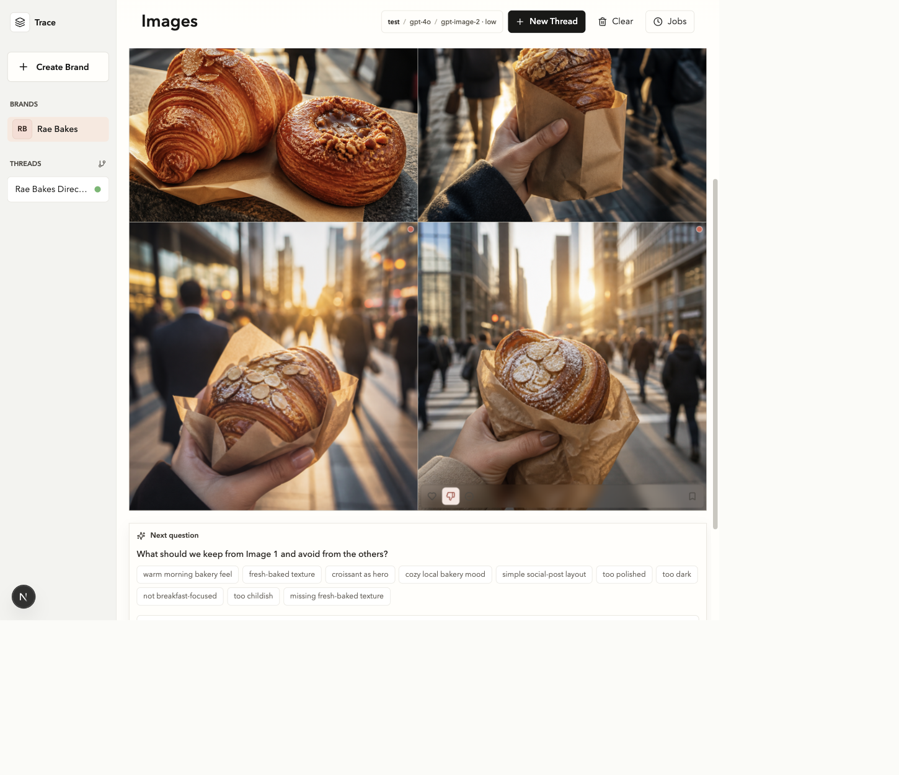


### Answer feedback option

Selected option: warm morning bakery feel

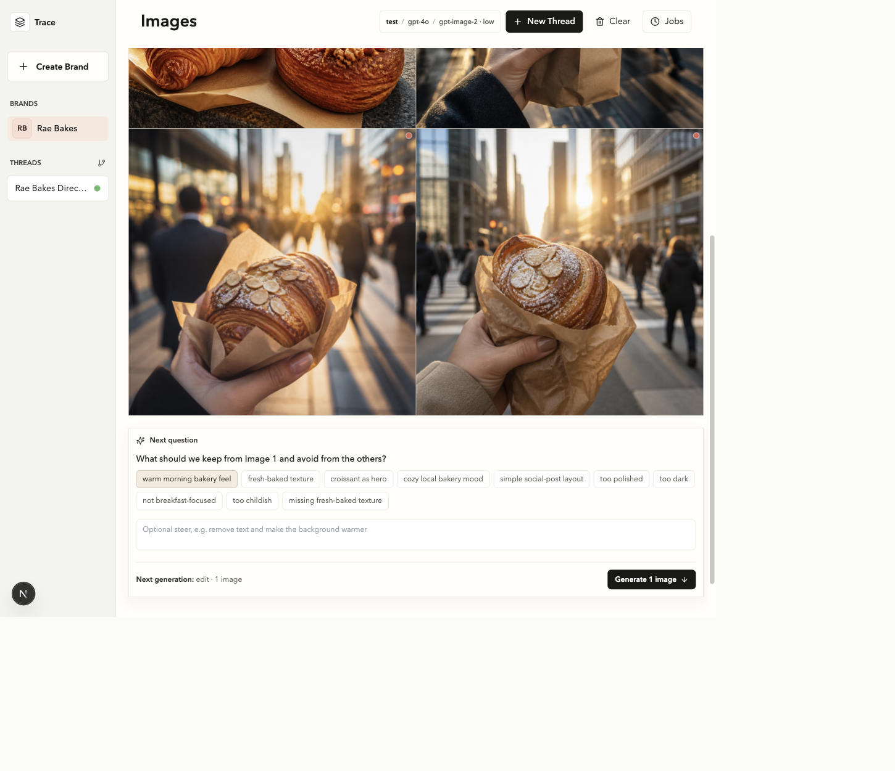


### Turn 1 answer

Selected first contextual chip.


### Generate next turn

Clicked Generate 1 image.


### Generate Turn 2

Clicked Generate 1 image after hard reload.


### Bug found - planner payload included base64 images

The context-window error was happening before image generation: selected parent variants were sent to the GPT-4o planner with full base64 src fields. Fix applied in components/generation/runNode.ts: planner and trace memory now receive compact variants with src removed and prompts shortened.

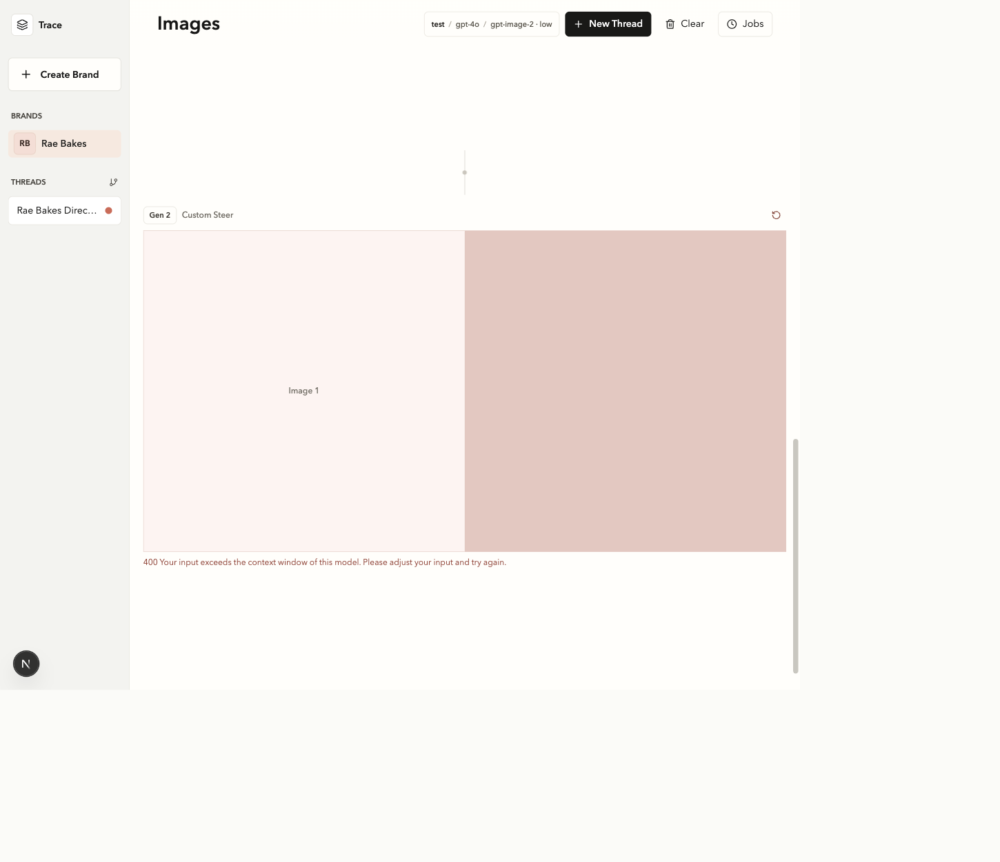


## Scenario 1 Final Pass After Planner Payload Fix

Persona: Sol, bakery owner reviewing commuter breakfast visuals. Brand: Sol Pastry; category: bakery; goal: product imagery; audience: office commuters. Tone and avoid notes left blank.

### Hard reload

Reloaded after stripping image src fields from planner payloads.


### Before interaction

Fresh reload before starting the scenario.

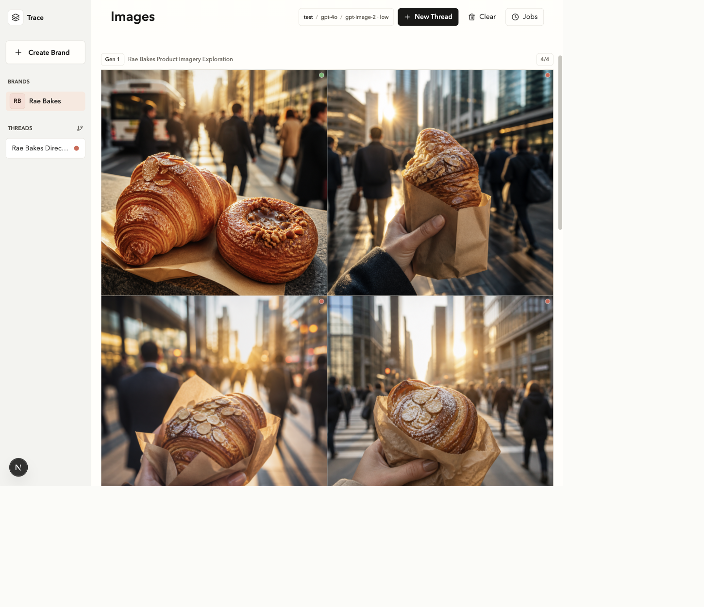


### Clear demo state

Clicked the visible Clear action to start from an empty local state.


### Open brand wizard

Opened Create Brand. Brand inputs: {"name":"Sol Pastry","category":"bakery","goal":"product imagery","audience":"office commuters"}. Tone and avoid notes intentionally left blank.

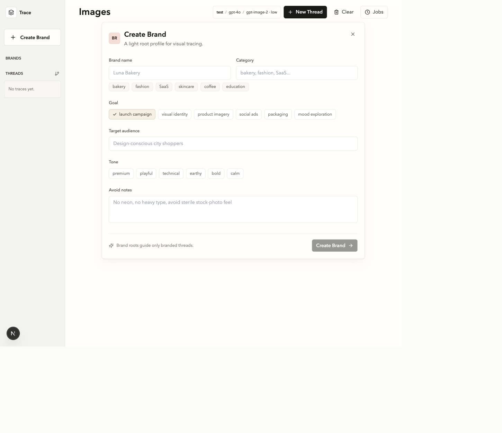


### Fill brief brand profile

Entered name, category, goal, and audience only. No tone chips or avoid notes.


### Create brand

Submitted the brand wizard.


### Start first exploration

Started the first generation thread for this brand.


### Generation ready: s1 planner fix turn1 ready

Detected 4 ready image like controls; expected at least 4.


### Turn 1 ready

Four generated images appeared as single full-bleed assets.


### React Like to Image 1

Clicked Like for Image 1.


### Turn 1 reaction

Liked Image 1.


### React Dislike to Image 2

Clicked Dislike for Image 2.

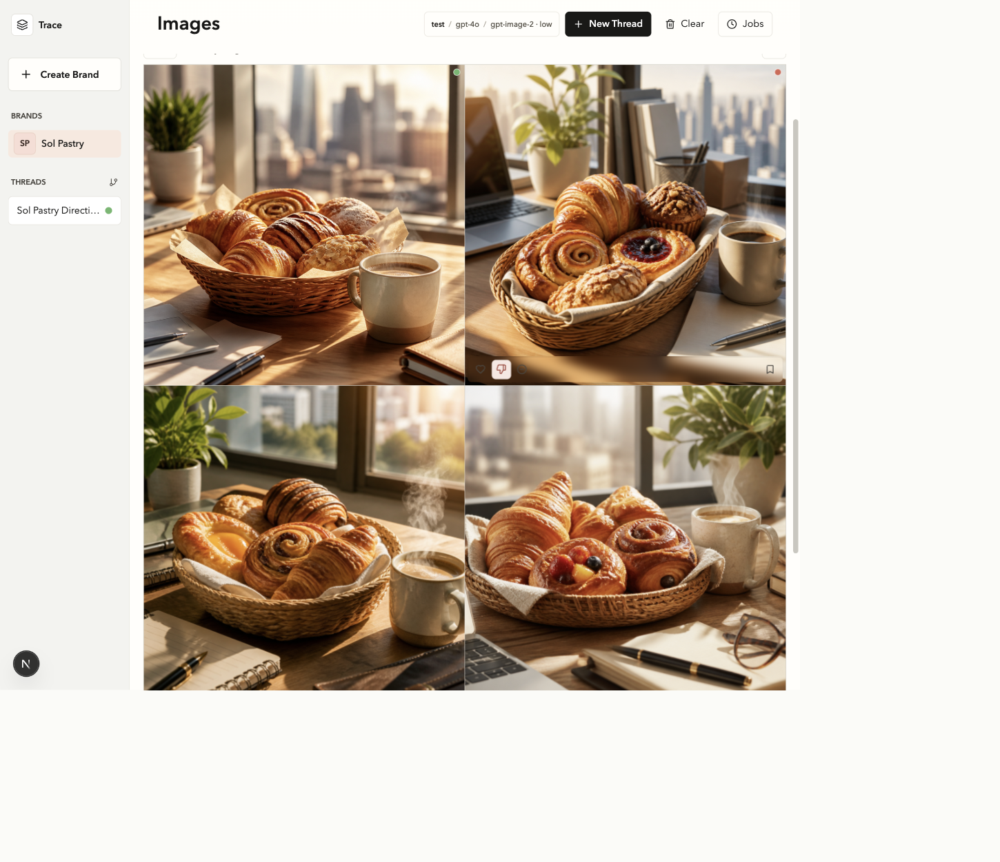


### Turn 1 reaction

Disliked Image 2.


### React Dislike to Image 3

Clicked Dislike for Image 3.


### Turn 1 reaction

Disliked Image 3.


### React Dislike to Image 4

Clicked Dislike for Image 4.

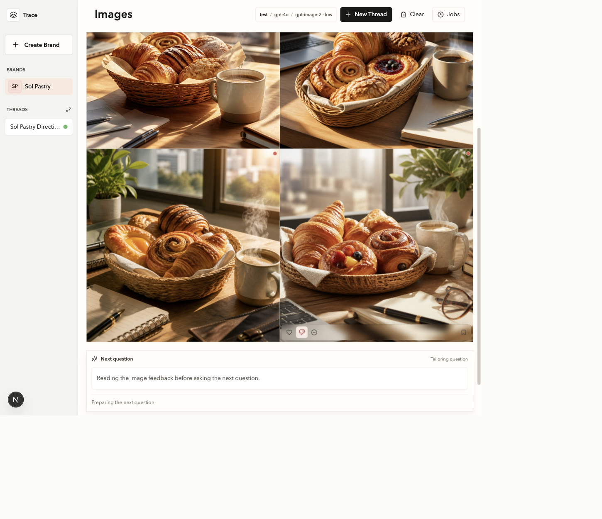


### Turn 1 reaction

Disliked Image 4.


### Question shown

Observed question panel.

```
- complementary:
  - generic: Trace
  - button "Create Brand":
    - generic: Create Brand
  - generic: Brands
  - generic: SP
  - generic: Sol Pastry
  - text: Threads
  - button "Sol Pastry Directions":
    - generic: Sol Pastry Directions
- main:
  - heading "Images" [level=1]
  - generic "Change OPENAI_DEMO_PROFILE in .env to switch between test and custom settings":
    - generic: test
    - generic: /
    - generic: gpt-4o
    - generic: /
    - generic: gpt-image-2 · low
  - button "New Thread":
    - text: New Thread
  - button "Clear":
    - text: Clear
  - button "Jobs":
    - text: Jobs
  - generic "Sol Pastry Directions":
    - generic: SP
    - paragraph: Sol Pastry
    - paragraph: bakery · product imagery
  - article:
    - generic: Gen 1
    - generic: Sol Pastry Image Directions
    - generic: 4/4
    - button "Image 1":
      - img "Image 1"
    - button "Like":
    - button "Dislike":
    - button "Skip":
    - button "Use as reference":
    - button "Image 2":
      - img "Image 2"
    - button "Like":
    - button "Dislike":
    - button "Skip":
    - button "Use as reference":
    - button "Image 3":
      - img "Image 3"
    - button "Like":
    - button "Dislike":
    - button "Skip":
    - button "Use as reference":
    - button "Image 4":
      - img "Image 4"
    - button "Like":
    - button "Dislike" [active]:
    - button "Skip":
    - button "Use as reference":
  - complementary:
    - text: Next question
    - paragraph: What should we keep from Image 1 and avoid from the others?
    - button "warm morning bakery feel"
    - button "fresh-baked texture"
    - button "croissant as hero"
    - button "cozy local bakery mood"
    - button "simple social-post layout"
    - button "too polished"
    - button "too dark"
    - button "not breakfast-focused"
    - button "too childish"
    - button "missing fresh-baked texture"
    - textbox "Optional steer, e.g. remove text and make the background warmer"
    - text: "Next generation:"
    - generic: refine · 1 image
    - button "Generate 1 image" [disabled]:
      - text: Generate 1 image
- button "Open Next
```

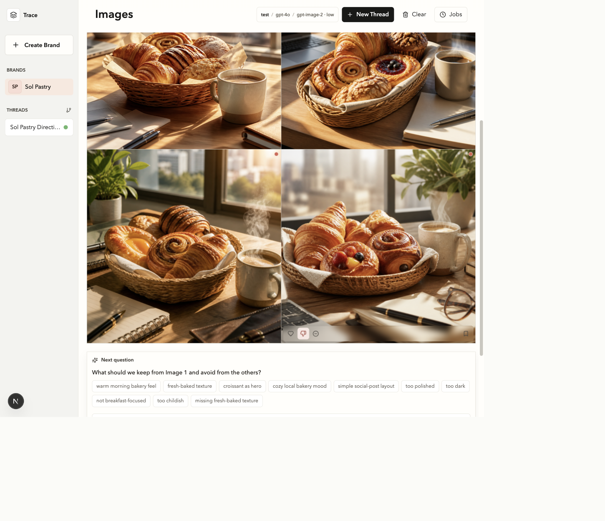


### Turn 1 follow-up

Keep/avoid question appears after all images are reviewed.


### Answer feedback option

Selected option: warm morning bakery feel

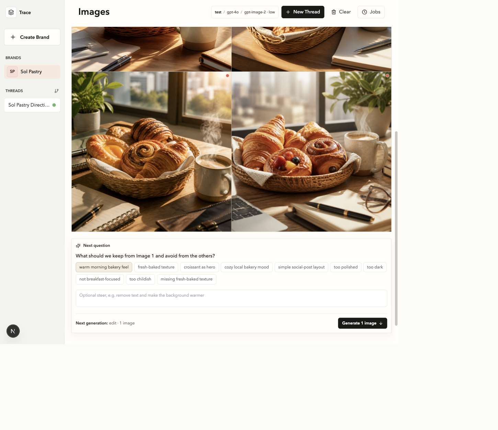


### Turn 1 answer

Selected first contextual reason chip.


### Generate next turn

Clicked Generate 1 image.

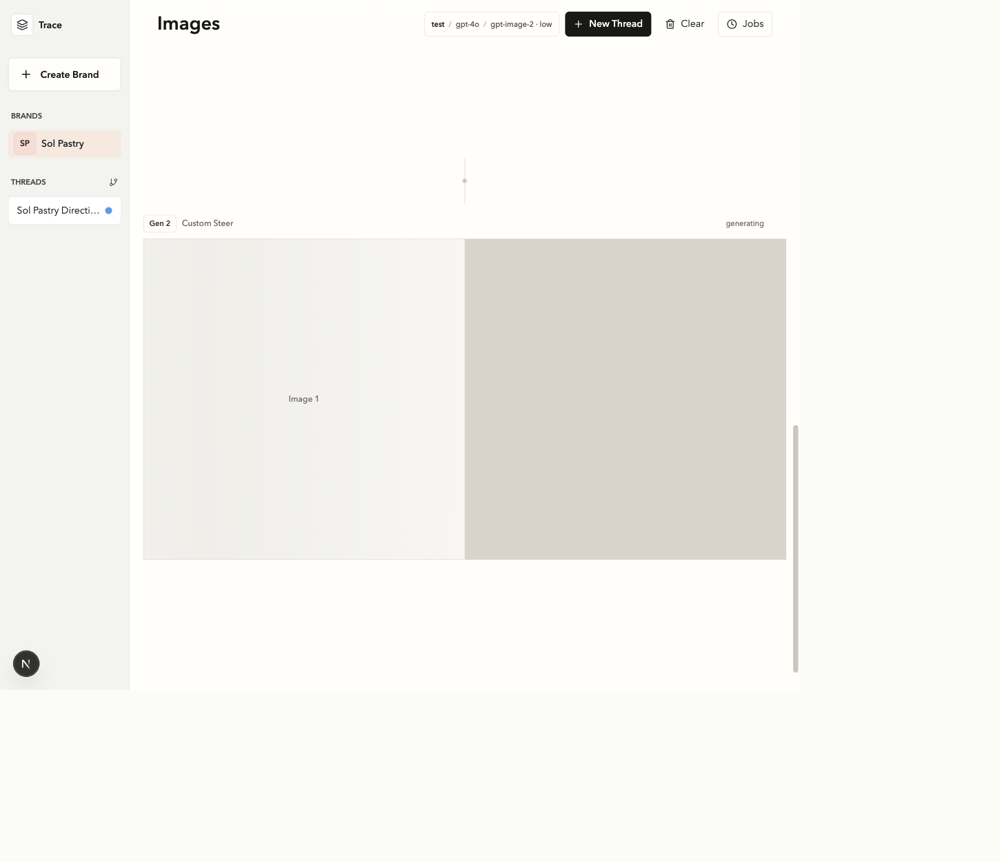


### Generate Turn 2

Clicked Generate 1 image after planner payload fix.

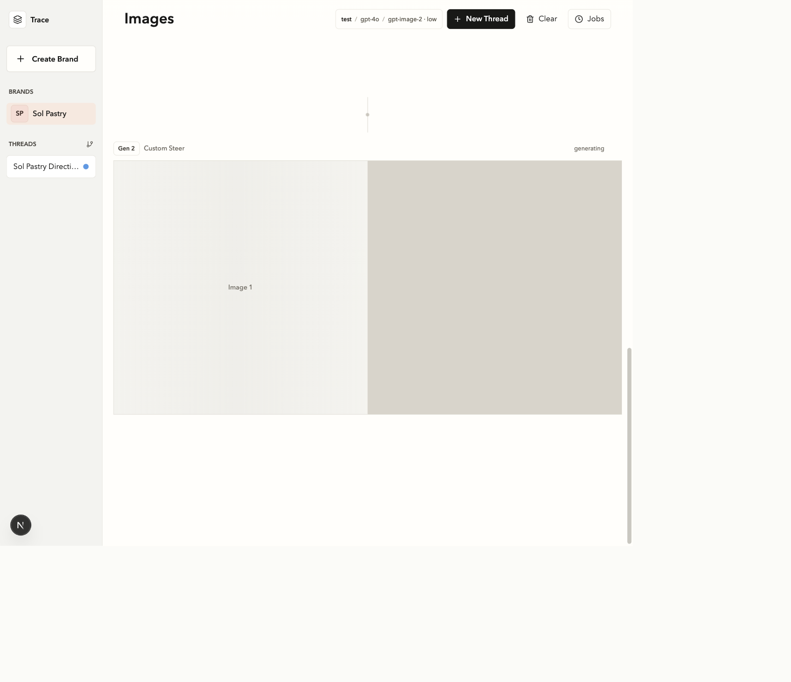


### Turn 2 ready

Second generation node has 1 generated image and no context-window error.

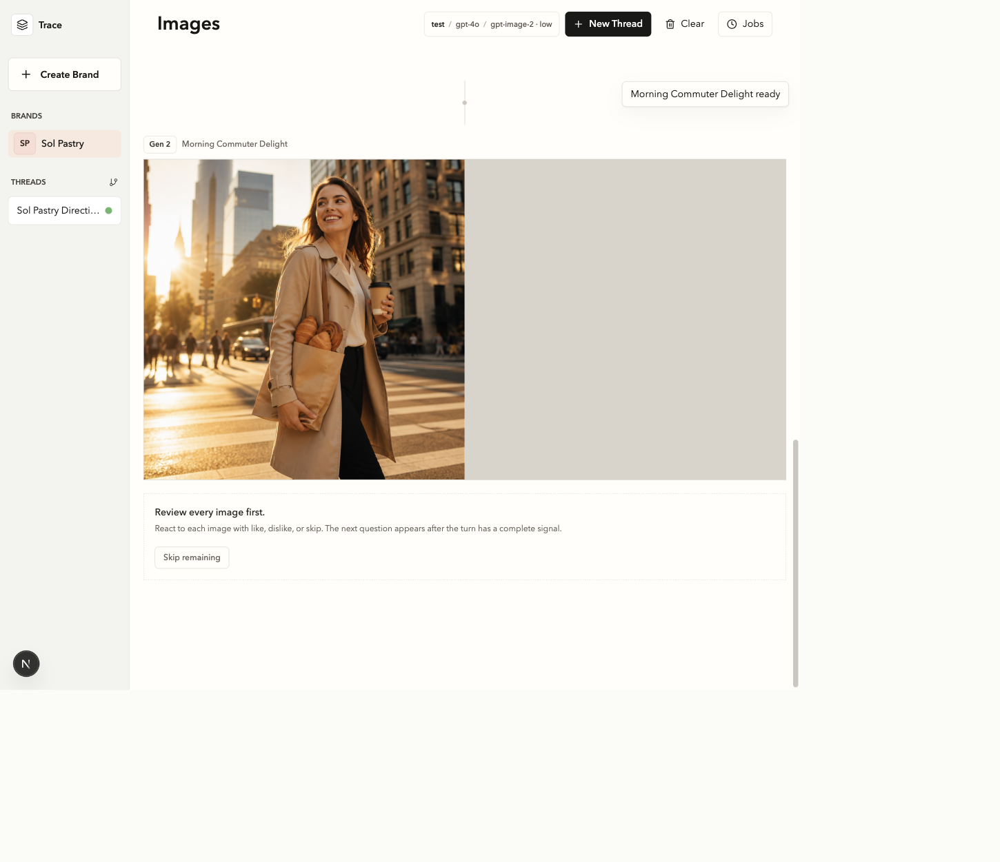


### React Dislike to Image 1

Clicked Dislike for Image 1.


### Turn 2 reaction

Disliked the single refined image.


### Question shown

Observed question panel.

```
- complementary:
  - generic: Trace
  - button "Create Brand":
    - generic: Create Brand
  - generic: Brands
  - generic: SP
  - generic: Sol Pastry
  - text: Threads
  - button "Sol Pastry Directions":
    - generic: Sol Pastry Directions
- main:
  - heading "Images" [level=1]
  - generic "Change OPENAI_DEMO_PROFILE in .env to switch between test and custom settings":
    - generic: test
    - generic: /
    - generic: gpt-4o
    - generic: /
    - generic: gpt-image-2 · low
  - button "New Thread":
    - text: New Thread
  - button "Clear":
    - text: Clear
  - button "Jobs":
    - text: Jobs
  - generic "Sol Pastry Directions":
    - generic: SP
    - paragraph: Sol Pastry
    - paragraph: bakery · product imagery
  - article:
    - generic: Gen 1
    - generic: Sol Pastry Image Directions
    - generic: 4/4
    - button "Image 1":
      - img "Image 1"
    - button "Like":
    - button "Dislike" [active]:
    - button "Skip":
    - button "Use as reference":
    - button "Image 2":
      - img "Image 2"
    - button "Like":
    - button "Dislike":
    - button "Skip":
    - button "Use as reference":
    - button "Image 3":
      - img "Image 3"
    - button "Like":
    - button "Dislike":
    - button "Skip":
    - button "Use as reference":
    - button "Image 4":
      - img "Image 4"
    - button "Like":
    - button "Dislike":
    - button "Skip":
    - button "Use as reference":
  - complementary:
    - text: Next question
    - paragraph: Are these missing because of style, audience, or goal?
    - button "style"
    - button "audience"
    - button "goal"
    - button "subject focus"
    - textbox "Optional steer, e.g. remove text and make the background warmer"
    - text: "Another option:"
    - generic: explore · 4 images
    - button "Again · 4" [disabled]:
      - text: Again · 4
  - article:
    - generic: Gen 2
    - generic: Morning Commuter Delight
    - button "Image 1":
      - img "Image 1"
    - button "Like":
    - button "Dislike":
    - button "Skip":
    - button "Use as reference":
  - complementary:
    - paragraph: Review every image first.
    - paragraph: React to each image with like, dislike, or skip. The next question appe
```


### Turn 2 follow-up

Expected a correction question about what changed in the wrong way.


### Answer feedback option

Selected option: style


### Turn 2 answer

Selected first correction reason chip.

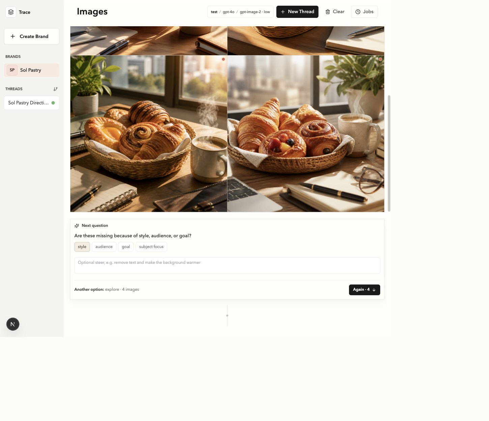


### Generate next turn

Clicked Again · 4.

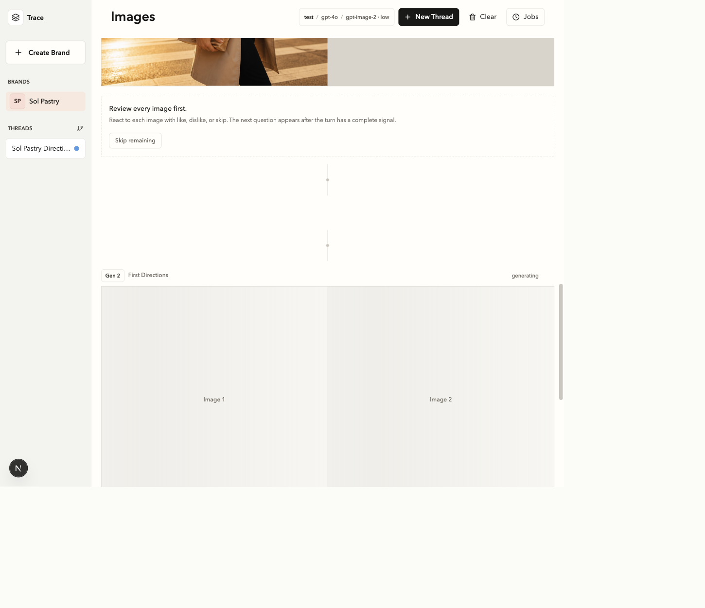


### Generate Turn 3

Clicked Generate 1 image for correction.


### Turn 3 ready

Third generation node has 4 corrected image.


## Scenario 1 Clean Scoped Pass

Persona: Tess, bakery owner choosing commuter breakfast imagery. Brand: Tess Croissant; category: bakery; goal: product imagery; audience: office commuters. Tone and avoid notes left blank. This pass uses scoped turn controls after fixing planner payload and QA automation targeting.

### Before interaction

Fresh reload before starting the scenario.


### Clear demo state

Clicked the visible Clear action to start from an empty local state.


### Open brand wizard

Opened Create Brand. Brand inputs: {"name":"Tess Croissant","category":"bakery","goal":"product imagery","audience":"office commuters"}. Tone and avoid notes intentionally left blank.


### Fill brief brand profile

Entered name, category, goal, and audience only. No tone chips or avoid notes.


### Create brand

Submitted the brand wizard.


### Start first exploration

Started the first generation thread for this brand.


### Generation ready: s1 clean turn1 ready

Detected 4 ready image like controls; expected at least 4.


### Turn 1 ready

Four generated image assets appeared.


### Turn 1 reaction

Liked Image 1.


### Turn 1 reaction

Disliked Image 2.


### Turn 1 reaction

Disliked Image 3.


### Turn 1 reaction

Disliked Image 4.


### Question shown

Observed question panel.

```
- complementary:
  - generic: Trace
  - button "Create Brand":
    - generic: Create Brand
  - generic: Brands
  - generic: TC
  - generic: Tess Croissant
  - text: Threads
  - button "Tess Croissant Directions":
    - generic: Tess Croissant Directions
- main:
  - heading "Images" [level=1]
  - generic "Change OPENAI_DEMO_PROFILE in .env to switch between test and custom settings":
    - generic: test
    - generic: /
    - generic: gpt-4o
    - generic: /
    - generic: gpt-image-2 · low
  - button "New Thread":
    - text: New Thread
  - button "Clear":
    - text: Clear
  - button "Jobs":
    - text: Jobs
  - generic "Tess Croissant Directions":
    - generic: TC
    - paragraph: Tess Croissant
    - paragraph: bakery · product imagery
  - article:
    - generic: Gen 1
    - generic: Tess Croissant Visual Directions
    - generic: 4/4
    - button "Image 1":
      - img "Image 1"
    - button "Like":
    - button "Dislike":
    - button "Skip":
    - button "Use as reference":
    - button "Image 2":
      - img "Image 2"
    - button "Like":
    - button "Dislike":
    - button "Skip":
    - button "Use as reference":
    - button "Image 3":
      - img "Image 3"
    - button "Like":
    - button "Dislike":
    - button "Skip":
    - button "Use as reference":
    - button "Image 4":
      - img "Image 4"
    - button "Like":
    - button "Dislike" [active]:
    - button "Skip":
    - button "Use as reference":
  - complementary:
    - text: Next question
    - paragraph: What should we keep from Image 1 and avoid from the others?
    - button "fresh-baked texture"
    - button "croissant as hero"
    - button "simple social-post layout"
    - button "missing fresh-baked texture"
    - button "not breakfast-focused"
    - button "too polished"
    - button "warm morning bakery feel"
    - button "cozy local bakery mood"
    - button "too dark"
    - button "too childish"
    - textbox "Optional steer, e.g. remove text and make the background warmer"
    - text: "Next generation:"
    - generic: refine · 1 image
    - button "Generate 1 image" [disabled]:
      - text: Generate 1 image
- button "Open Next
```


### Turn 1 follow-up

What should we keep from Image 1 and avoid from the others?


### Turn 1 answer

Selected feedback chip: fresh-baked texture.


### Generate Turn 2

Clicked Generate 1 image.


### Turn 2 ready

Gen 2 rendered 1 image.


### Turn 2 reaction

Disliked the refined image.


### Question shown

Observed question panel.

```
- complementary:
  - generic: Trace
  - button "Create Brand":
    - generic: Create Brand
  - generic: Brands
  - generic: TC
  - generic: Tess Croissant
  - text: Threads
  - button "Tess Croissant Directions":
    - generic: Tess Croissant Directions
- main:
  - heading "Images" [level=1]
  - generic "Change OPENAI_DEMO_PROFILE in .env to switch between test and custom settings":
    - generic: test
    - generic: /
    - generic: gpt-4o
    - generic: /
    - generic: gpt-image-2 · low
  - button "New Thread":
    - text: New Thread
  - button "Clear":
    - text: Clear
  - button "Jobs":
    - text: Jobs
  - generic "Tess Croissant Directions":
    - generic: TC
    - paragraph: Tess Croissant
    - paragraph: bakery · product imagery
  - article:
    - generic: Gen 1
    - generic: Tess Croissant Visual Directions
    - generic: 4/4
    - button "Image 1":
      - img "Image 1"
    - button "Like":
    - button "Dislike":
    - button "Skip":
    - button "Use as reference":
    - button "Image 2":
      - img "Image 2"
    - button "Like":
    - button "Dislike":
    - button "Skip":
    - button "Use as reference":
    - button "Image 3":
      - img "Image 3"
    - button "Like":
    - button "Dislike":
    - button "Skip":
    - button "Use as reference":
    - button "Image 4":
      - img "Image 4"
    - button "Like":
    - button "Dislike":
    - button "Skip":
    - button "Use as reference":
  - complementary:
    - text: Next question
    - paragraph: What should we keep from Image 1 and avoid from the others?
    - button "missing commuter context"
    - button "lacks fresh-baked texture"
    - button "too busy background"
    - button "not minimalist enough"
    - button "warm morning bakery feel"
    - button "fresh-baked texture"
    - button "croissant as hero"
    - button "cozy local bakery mood"
    - button "simple social-post layout"
    - button "too polished"
    - button "too dark"
    - button "not breakfast-focused"
    - textbox "Optional steer, e.g. remove text and make the background warmer"
    - text: "Another option:"
    - generic: edit · 1 image
    - button "Again · 1":
      - text: Again · 1
  - article:
    - generic: 
```


### Turn 2 follow-up

Should we revise the brief before continuing?


### Turn 2 answer

Selected correction chip: Apply brief revision.


### Generate Turn 3

Clicked Generate 1 image for corrected continuation.


### Turn 3 ready

Gen 3 rendered 1 corrected image.


### Turn 3 reaction

Liked the corrected image.


### Question shown

Observed question panel.

```
- complementary:
  - generic: Trace
  - button "Create Brand":
    - generic: Create Brand
  - generic: Brands
  - generic: TC
  - generic: Tess Croissant
  - text: Threads
  - button "Tess Croissant Directions":
    - generic: Tess Croissant Directions
- main:
  - heading "Images" [level=1]
  - generic "Change OPENAI_DEMO_PROFILE in .env to switch between test and custom settings":
    - generic: test
    - generic: /
    - generic: gpt-4o
    - generic: /
    - generic: gpt-image-2 · low
  - button "New Thread":
    - text: New Thread
  - button "Clear":
    - text: Clear
  - button "Jobs":
    - text: Jobs
  - generic "Tess Croissant Directions":
    - generic: TC
    - paragraph: Tess Croissant
    - paragraph: bakery · product imagery
  - article:
    - generic: Gen 1
    - generic: Tess Croissant Visual Directions
    - generic: 4/4
    - button "Image 1":
      - img "Image 1"
    - button "Like":
    - button "Dislike":
    - button "Skip":
    - button "Use as reference":
    - button "Image 2":
      - img "Image 2"
    - button "Like":
    - button "Dislike":
    - button "Skip":
    - button "Use as reference":
    - button "Image 3":
      - img "Image 3"
    - button "Like":
    - button "Dislike":
    - button "Skip":
    - button "Use as reference":
    - button "Image 4":
      - img "Image 4"
    - button "Like":
    - button "Dislike":
    - button "Skip":
    - button "Use as reference":
  - complementary:
    - text: Next question
    - paragraph: What should we keep from Image 1 and avoid from the others?
    - button "fresh-baked texture"
    - button "modern minimalist appeal"
    - button "city background not impactful enough"
    - button "missing breakfast vibe"
    - button "too tech-focused"
    - button "warm morning bakery feel"
    - button "croissant as hero"
    - button "cozy local bakery mood"
    - button "simple social-post layout"
    - button "too polished"
    - button "too dark"
    - button "not breakfast-focused"
    - textbox "Optional steer, e.g. remove text and make the background warmer"
    - text: "Another option:"
    - generic: edit · 1 image
    - button "Again · 1":
      - text: Again · 1
  - article:
    - 
```


### Turn 3 follow-up

All four work. What should we optimize for?


### Bug found - one-image turns used four-image logic

Scenario 1 reached Gen 2 and Gen 3, but the follow-up questions were wrong: one disliked refinement asked to revise the brief, and one liked correction said all four work. Fix applied in lib/feedback/decisionEngine.ts: single-image like/dislike handling now runs before all-liked/all-disliked aggregate logic. Added feedback scenario tests for both cases.


## Scenario 1 Verified Pass After Single-Image Decision Fix

Persona: Bea, bakery owner reviewing commuter breakfast imagery. Brand: Bea Bakery; category: bakery; goal: product imagery; audience: office commuters. Tone and avoid notes left blank.

### Before interaction

Fresh reload before starting the scenario.


### Clear demo state

Clicked the visible Clear action to start from an empty local state.


### Open brand wizard

Opened Create Brand. Brand inputs: {"name":"Bea Bakery","category":"bakery","goal":"product imagery","audience":"office commuters"}. Tone and avoid notes intentionally left blank.


### Fill brief brand profile

Entered name, category, goal, and audience only. No tone chips or avoid notes.


### Create brand

Submitted the brand wizard.


### Start first exploration

Started the first generation thread for this brand.


### Generation ready: s1 verified turn1 ready

Detected 4 ready image like controls; expected at least 4.


### Turn 1 ready

Four generated single-image assets appeared.


### Turn 1 reaction

Liked Image 1.


### Turn 1 reaction

Disliked Image 2.


### Turn 1 reaction

Disliked Image 3.


### Turn 1 reaction

Disliked Image 4.


### Question shown

Observed question panel.

```
- complementary:
  - generic: Trace
  - button "Create Brand":
    - generic: Create Brand
  - generic: Brands
  - generic: BB
  - generic: Bea Bakery
  - text: Threads
  - button "Bea Bakery Directions":
    - generic: Bea Bakery Directions
- main:
  - heading "Images" [level=1]
  - generic "Change OPENAI_DEMO_PROFILE in .env to switch between test and custom settings":
    - generic: test
    - generic: /
    - generic: gpt-4o
    - generic: /
    - generic: gpt-image-2 · low
  - button "New Thread":
    - text: New Thread
  - button "Clear":
    - text: Clear
  - button "Jobs":
    - text: Jobs
  - generic "Bea Bakery Directions":
    - generic: BB
    - paragraph: Bea Bakery
    - paragraph: bakery · product imagery
  - article:
    - generic: Gen 1
    - generic: Bea Bakery Image Exploration
    - generic: 4/4
    - button "Image 1":
      - img "Image 1"
    - button "Like":
    - button "Dislike":
    - button "Skip":
    - button "Use as reference":
    - button "Image 2":
      - img "Image 2"
    - button "Like":
    - button "Dislike":
    - button "Skip":
    - button "Use as reference":
    - button "Image 3":
      - img "Image 3"
    - button "Like":
    - button "Dislike":
    - button "Skip":
    - button "Use as reference":
    - button "Image 4":
      - img "Image 4"
    - button "Like":
    - button "Dislike" [active]:
    - button "Skip":
    - button "Use as reference":
  - complementary:
    - text: Next question
    - paragraph: What should we keep from Image 1 and avoid from the others?
    - button "warm morning bakery feel"
    - button "fresh-baked texture"
    - button "croissant as hero"
    - button "cozy local bakery mood"
    - button "simple social-post layout"
    - button "too polished"
    - button "too dark"
    - button "not breakfast-focused"
    - button "too childish"
    - button "missing fresh-baked texture"
    - textbox "Optional steer, e.g. remove text and make the background warmer"
    - text: "Next generation:"
    - generic: refine · 1 image
    - button "Generate 1 image" [disabled]:
      - text: Generate 1 image
- button "Open Next
```


### Turn 1 follow-up

What should we keep from Image 1 and avoid from the others?


### Turn 1 answer

Selected feedback chip: warm morning bakery feel.


### Generate Turn 2

Clicked Generate 1 image.


### Turn 2 ready

Gen 2 rendered 1 image.


### Turn 2 reaction

Disliked the refined image.


### Question shown

Observed question panel.

```
- complementary:
  - generic: Trace
  - button "Create Brand":
    - generic: Create Brand
  - generic: Brands
  - generic: BB
  - generic: Bea Bakery
  - text: Threads
  - button "Bea Bakery Directions":
    - generic: Bea Bakery Directions
- main:
  - heading "Images" [level=1]
  - generic "Change OPENAI_DEMO_PROFILE in .env to switch between test and custom settings":
    - generic: test
    - generic: /
    - generic: gpt-4o
    - generic: /
    - generic: gpt-image-2 · low
  - button "New Thread":
    - text: New Thread
  - button "Clear":
    - text: Clear
  - button "Jobs":
    - text: Jobs
  - generic "Bea Bakery Directions":
    - generic: BB
    - paragraph: Bea Bakery
    - paragraph: bakery · product imagery
  - article:
    - generic: Gen 1
    - generic: Bea Bakery Image Exploration
    - generic: 4/4
    - button "Image 1":
      - img "Image 1"
    - button "Like":
    - button "Dislike":
    - button "Skip":
    - button "Use as reference":
    - button "Image 2":
      - img "Image 2"
    - button "Like":
    - button "Dislike":
    - button "Skip":
    - button "Use as reference":
    - button "Image 3":
      - img "Image 3"
    - button "Like":
    - button "Dislike":
    - button "Skip":
    - button "Use as reference":
    - button "Image 4":
      - img "Image 4"
    - button "Like":
    - button "Dislike":
    - button "Skip":
    - button "Use as reference":
  - complementary:
    - text: Next question
    - paragraph: What should we keep from Image 1 and avoid from the others?
    - button "warm morning bakery feel"
    - button "fresh-baked texture"
    - button "croissant as hero"
    - button "cozy local bakery mood"
    - button "simple social-post layout"
    - button "too polished"
    - button "too dark"
    - button "not breakfast-focused"
    - button "too childish"
    - button "missing fresh-baked texture"
    - textbox "Optional steer, e.g. remove text and make the background warmer"
    - text: "Another option:"
    - generic: edit · 1 image
    - button "Again · 1":
      - text: Again · 1
  - article:
    - generic: Gen 2
    - generic: Cozy Urban Morning
    - button "Image 1":
      - img "Image 1"
    - button "Like":
```


### Turn 2 follow-up

You liked open subject direction and warm before. What changed in the wrong way?


### Turn 2 answer

Selected correction chip: too polished.


### Generate Turn 3

Clicked Generate 1 image for corrected continuation.


### Turn 3 ready

Gen 3 rendered 1 corrected image.


### Turn 3 reaction

Liked the corrected image.


### Question shown

Observed question panel.

```
- complementary:
  - generic: Trace
  - button "Create Brand":
    - generic: Create Brand
  - generic: Brands
  - generic: BB
  - generic: Bea Bakery
  - text: Threads
  - button "Bea Bakery Directions":
    - generic: Bea Bakery Directions
- main:
  - heading "Images" [level=1]
  - generic "Change OPENAI_DEMO_PROFILE in .env to switch between test and custom settings":
    - generic: test
    - generic: /
    - generic: gpt-4o
    - generic: /
    - generic: gpt-image-2 · low
  - button "New Thread":
    - text: New Thread
  - button "Clear":
    - text: Clear
  - button "Jobs":
    - text: Jobs
  - generic "Bea Bakery Directions":
    - generic: BB
    - paragraph: Bea Bakery
    - paragraph: bakery · product imagery
  - article:
    - generic: Gen 1
    - generic: Bea Bakery Image Exploration
    - generic: 4/4
    - button "Image 1":
      - img "Image 1"
    - button "Like":
    - button "Dislike":
    - button "Skip":
    - button "Use as reference":
    - button "Image 2":
      - img "Image 2"
    - button "Like":
    - button "Dislike":
    - button "Skip":
    - button "Use as reference":
    - button "Image 3":
      - img "Image 3"
    - button "Like":
    - button "Dislike":
    - button "Skip":
    - button "Use as reference":
    - button "Image 4":
      - img "Image 4"
    - button "Like":
    - button "Dislike":
    - button "Skip":
    - button "Use as reference":
  - complementary:
    - text: Next question
    - paragraph: What should we keep from Image 1 and avoid from the others?
    - button "warm morning bakery feel"
    - button "fresh-baked texture"
    - button "croissant as hero"
    - button "cozy local bakery mood"
    - button "simple social-post layout"
    - button "too polished"
    - button "too dark"
    - button "not breakfast-focused"
    - button "too childish"
    - button "missing fresh-baked texture"
    - textbox "Optional steer, e.g. remove text and make the background warmer"
    - text: "Another option:"
    - generic: edit · 1 image
    - button "Again · 1":
      - text: Again · 1
  - article:
    - generic: Gen 2
    - generic: Cozy Urban Morning
    - button "Image 1":
      - img "Image 1"
    - button "Like":
```


### Turn 3 follow-up

Should this become the direction, or should we make variations?


## Scenario 2 - User Dislikes All 4 Twice

Persona: Mina, skincare founder testing trust-building launch visuals. Brand: Dewleaf Skin; category: skincare; goal: social ads; audience: busy urban women. Tone and avoid notes left blank.

### Before interaction

Fresh reload before starting the scenario.


### Clear demo state

Clicked the visible Clear action to start from an empty local state.


### Open brand wizard

Opened Create Brand. Brand inputs: {"name":"Dewleaf Skin","category":"skincare","goal":"social ads","audience":"busy urban women"}. Tone and avoid notes intentionally left blank.


### Fill brief brand profile

Entered name, category, goal, and audience only. No tone chips or avoid notes.


### Create brand

Submitted the brand wizard.


### Start first exploration

Started the first generation thread for this brand.


### Generation ready: s2 turn1 ready

Detected 4 ready image like controls; expected at least 4.


### Turn 1 ready

Four skincare social ad directions generated.


### Turn 1 reaction

Disliked all four generated images.


### Question shown

Observed question panel.

```
- complementary:
  - generic: Trace
  - button "Create Brand":
    - generic: Create Brand
  - generic: Brands
  - generic: DS
  - generic: Dewleaf Skin
  - text: Threads
  - button "Dewleaf Skin Directions":
    - generic: Dewleaf Skin Directions
- main:
  - heading "Images" [level=1]
  - generic "Change OPENAI_DEMO_PROFILE in .env to switch between test and custom settings":
    - generic: test
    - generic: /
    - generic: gpt-4o
    - generic: /
    - generic: gpt-image-2 · low
  - button "New Thread":
    - text: New Thread
  - button "Clear":
    - text: Clear
  - button "Jobs":
    - text: Jobs
  - generic "Dewleaf Skin Directions":
    - generic: DS
    - paragraph: Dewleaf Skin
    - paragraph: skincare · social ads
  - article:
    - generic: Gen 1
    - generic: Dewleaf Skin Social Ads Visual Directions
    - generic: 4/4
    - button "Image 1":
      - img "Image 1"
    - button "Like":
    - button "Dislike":
    - button "Skip":
    - button "Use as reference":
    - button "Image 2":
      - img "Image 2"
    - button "Like":
    - button "Dislike":
    - button "Skip":
    - button "Use as reference":
    - button "Image 3":
      - img "Image 3"
    - button "Like":
    - button "Dislike":
    - button "Skip":
    - button "Use as reference":
    - button "Image 4":
      - img "Image 4"
    - button "Like":
    - button "Dislike" [active]:
    - button "Skip":
    - button "Use as reference":
  - complementary:
    - text: Next question
    - paragraph: Are these missing because of style, audience, or goal?
    - button "style"
    - button "audience"
    - button "goal"
    - button "subject focus"
    - textbox "Optional steer, e.g. remove text and make the background warmer"
    - text: "Next generation:"
    - generic: explore · 4 images
    - button "Generate 4 images" [disabled]:
      - text: Generate 4 images
- button "Open Next
```


### Turn 1 follow-up

Are these missing because of style, audience, or goal?


### Turn 1 answer

Selected reason: style.


### Generate Turn 2

Clicked Generate 4 images for shifted alternatives.


### Turn 2 ready

Second generation rendered 4 images.


### Turn 2 reaction

Disliked all four shifted alternatives.


### Question shown

Observed question panel.

```
- complementary:
  - generic: Trace
  - button "Create Brand":
    - generic: Create Brand
  - generic: Brands
  - generic: DS
  - generic: Dewleaf Skin
  - text: Threads
  - button "Dewleaf Skin Directions":
    - generic: Dewleaf Skin Directions
- main:
  - heading "Images" [level=1]
  - generic "Change OPENAI_DEMO_PROFILE in .env to switch between test and custom settings":
    - generic: test
    - generic: /
    - generic: gpt-4o
    - generic: /
    - generic: gpt-image-2 · low
  - button "New Thread":
    - text: New Thread
  - button "Clear":
    - text: Clear
  - button "Jobs":
    - text: Jobs
  - generic "Dewleaf Skin Directions":
    - generic: DS
    - paragraph: Dewleaf Skin
    - paragraph: skincare · social ads
  - article:
    - generic: Gen 1
    - generic: Dewleaf Skin Social Ads Visual Directions
    - generic: 4/4
    - button "Image 1":
      - img "Image 1"
    - button "Like":
    - button "Dislike":
    - button "Skip":
    - button "Use as reference":
    - button "Image 2":
      - img "Image 2"
    - button "Like":
    - button "Dislike":
    - button "Skip":
    - button "Use as reference":
    - button "Image 3":
      - img "Image 3"
    - button "Like":
    - button "Dislike":
    - button "Skip":
    - button "Use as reference":
    - button "Image 4":
      - img "Image 4"
    - button "Like":
    - button "Dislike":
    - button "Skip":
    - button "Use as reference":
  - complementary:
    - text: Next question
    - paragraph: Should we revise the brief before continuing?
    - textbox "Sharper goal": social ads
    - textbox "Audience": busy urban women
    - textbox "Tone, comma separated"
    - textbox "Avoid"
    - button "Apply brief revision"
    - textbox "Optional steer, e.g. remove text and make the background warmer"
    - text: "Another option:"
    - generic: revise goal · 4 images
    - button "Again · 4" [disabled]:
      - text: Again · 4
  - article:
    - generic: Gen 2
    - generic: Brand Image Trace - Style Shift
    - generic: 4/4
    - button "Image 1":
      - img "Image 1"
    - button "Like":
    - button "Dislike":
    - button "Skip":
    - button "Use as reference":
    - button "Image 2":
      -
```


### Turn 2 follow-up

Should we revise the brief before continuing?


### Apply goal revision

Applied the goal revision form using the existing brand fields for this test pass.


### Generate Turn 3

Clicked Generate 4 images from the revised brief state.


### Turn 3 ready

Third generation rendered 4 revised-goal images.


### Turn 3 reaction

Liked Image 3 after the revised-goal generation.


### Question shown

Observed question panel.

```
- complementary:
  - generic: Trace
  - button "Create Brand":
    - generic: Create Brand
  - generic: Brands
  - generic: DS
  - generic: Dewleaf Skin
  - text: Threads
  - button "Dewleaf Skin Directions":
    - generic: Dewleaf Skin Directions
- main:
  - heading "Images" [level=1]
  - generic "Change OPENAI_DEMO_PROFILE in .env to switch between test and custom settings":
    - generic: test
    - generic: /
    - generic: gpt-4o
    - generic: /
    - generic: gpt-image-2 · low
  - button "New Thread":
    - text: New Thread
  - button "Clear":
    - text: Clear
  - button "Jobs":
    - text: Jobs
  - generic "Dewleaf Skin Directions":
    - generic: DS
    - paragraph: Dewleaf Skin
    - paragraph: skincare · social ads
  - article:
    - generic: Gen 1
    - generic: Dewleaf Skin Social Ads Visual Directions
    - generic: 4/4
    - button "Image 1":
      - img "Image 1"
    - button "Like":
    - button "Dislike":
    - button "Skip":
    - button "Use as reference":
    - button "Image 2":
      - img "Image 2"
    - button "Like":
    - button "Dislike":
    - button "Skip":
    - button "Use as reference":
    - button "Image 3":
      - img "Image 3"
    - button "Like":
    - button "Dislike":
    - button "Skip":
    - button "Use as reference":
    - button "Image 4":
      - img "Image 4"
    - button "Like":
    - button "Dislike":
    - button "Skip":
    - button "Use as reference":
  - complementary:
    - text: Next question
    - paragraph: Should we revise the brief before continuing?
    - textbox "Sharper goal": social ads
    - textbox "Audience": busy urban women
    - textbox "Tone, comma separated"
    - textbox "Avoid"
    - button "Apply brief revision"
    - textbox "Optional steer, e.g. remove text and make the background warmer"
    - text: "Another option:"
    - generic: revise goal · 4 images
    - button "Again · 4" [disabled]:
      - text: Again · 4
  - article:
    - generic: Gen 2
    - generic: Brand Image Trace - Style Shift
    - generic: 4/4
    - button "Image 1":
      - img "Image 1"
    - button "Like":
    - button "Dislike":
    - button "Skip":
    - button "Use as reference":
    - button "Image 2":
      -
```


### Turn 3 follow-up

Skip remaining


### Turn 3 complete signal

Skipped the other three images so the single liked Image 3 becomes the clear signal.


### Question shown

Observed question panel.

```
- complementary:
  - generic: Trace
  - button "Create Brand":
    - generic: Create Brand
  - generic: Brands
  - generic: DS
  - generic: Dewleaf Skin
  - text: Threads
  - button "Dewleaf Skin Directions":
    - generic: Dewleaf Skin Directions
- main:
  - heading "Images" [level=1]
  - generic "Change OPENAI_DEMO_PROFILE in .env to switch between test and custom settings":
    - generic: test
    - generic: /
    - generic: gpt-4o
    - generic: /
    - generic: gpt-image-2 · low
  - button "New Thread":
    - text: New Thread
  - button "Clear":
    - text: Clear
  - button "Jobs":
    - text: Jobs
  - generic "Dewleaf Skin Directions":
    - generic: DS
    - paragraph: Dewleaf Skin
    - paragraph: skincare · social ads
  - article:
    - generic: Gen 1
    - generic: Dewleaf Skin Social Ads Visual Directions
    - generic: 4/4
    - button "Image 1":
      - img "Image 1"
    - button "Like":
    - button "Dislike":
    - button "Skip":
    - button "Use as reference":
    - button "Image 2":
      - img "Image 2"
    - button "Like":
    - button "Dislike":
    - button "Skip":
    - button "Use as reference":
    - button "Image 3":
      - img "Image 3"
    - button "Like":
    - button "Dislike":
    - button "Skip":
    - button "Use as reference":
    - button "Image 4":
      - img "Image 4"
    - button "Like":
    - button "Dislike":
    - button "Skip":
    - button "Use as reference":
  - complementary:
    - text: Next question
    - paragraph: Should we revise the brief before continuing?
    - textbox "Sharper goal": social ads
    - textbox "Audience": busy urban women
    - textbox "Tone, comma separated"
    - textbox "Avoid"
    - button "Apply brief revision"
    - textbox "Optional steer, e.g. remove text and make the background warmer"
    - text: "Another option:"
    - generic: revise goal · 4 images
    - button "Again · 4" [disabled]:
      - text: Again · 4
  - article:
    - generic: Gen 2
    - generic: Brand Image Trace - Style Shift
    - generic: 4/4
    - button "Image 1":
      - img "Image 1"
    - button "Like":
    - button "Dislike":
    - button "Skip":
    - button "Use as reference":
    - button "Image 2":
      -
```


### Turn 3 follow-up after complete signal

What feels closest?


### Bug found - post-rejection positive signal too generic

After two all-disliked turns and one finally liked image, the app asked generic “What feels closest?” instead of “What finally worked here?”. Fix applied in lib/feedback/decisionEngine.ts: macro memory now detects a first positive signal after repeated rejection and asks what finally worked, then plans a 1-image refinement. Added scenario test coverage.


### Reload Scenario 2 state

Reloaded persisted Scenario 2 state after the decision-engine fix so the Turn 3 follow-up recomputes.


### Question shown

Observed question panel.

```
- complementary:
  - generic: Trace
  - button "Create Brand":
    - generic: Create Brand
  - generic: Brands
  - generic: DS
  - generic: Dewleaf Skin
  - text: Threads
  - button "Dewleaf Skin Directions":
    - generic: Dewleaf Skin Directions
- main:
  - heading "Images" [level=1]
  - generic "Change OPENAI_DEMO_PROFILE in .env to switch between test and custom settings":
    - generic: test
    - generic: /
    - generic: gpt-4o
    - generic: /
    - generic: gpt-image-2 · low
  - button "New Thread":
    - text: New Thread
  - button "Clear":
    - text: Clear
  - button "Jobs":
    - text: Jobs
  - generic "Dewleaf Skin Directions":
    - generic: DS
    - paragraph: Dewleaf Skin
    - paragraph: skincare · social ads
  - article:
    - generic: Gen 1
    - generic: Dewleaf Skin Social Ads Visual Directions
    - generic: 4/4
    - button "Image 1":
      - img "Image 1"
    - button "Like":
    - button "Dislike":
    - button "Skip":
    - button "Use as reference":
    - button "Image 2":
      - img "Image 2"
    - button "Like":
    - button "Dislike":
    - button "Skip":
    - button "Use as reference":
    - button "Image 3":
      - img "Image 3"
    - button "Like":
    - button "Dislike":
    - button "Skip":
    - button "Use as reference":
    - button "Image 4":
      - img "Image 4"
    - button "Like":
    - button "Dislike":
    - button "Skip":
    - button "Use as reference":
  - complementary:
    - text: Next question
    - paragraph: Should we revise the brief before continuing?
    - textbox "Sharper goal": social ads
    - textbox "Audience": busy urban women
    - textbox "Tone, comma separated"
    - textbox "Avoid"
    - button "Apply brief revision"
    - textbox "Optional steer, e.g. remove text and make the background warmer"
    - text: "Another option:"
    - generic: revise goal · 4 images
    - button "Again · 4" [disabled]:
      - text: Again · 4
  - article:
    - generic: Gen 2
    - generic: Brand Image Trace - Style Shift
    - generic: 4/4
    - button "Image 1":
      - img "Image 1"
    - button "Like":
    - button "Dislike":
    - button "Skip":
    - button "Use as reference":
    - button "Image 2":
      -
```


### Turn 3 corrected follow-up

What finally worked here?


## Scenario 3 - User Likes Everything

Persona: Jules, coffee founder choosing launch campaign visuals. Brand: North Cup; category: coffee; goal: launch campaign; audience: remote workers. Tone and avoid notes left blank.

### Before interaction

Fresh reload before starting the scenario.


### Clear demo state

Clicked the visible Clear action to start from an empty local state.


### Open brand wizard

Opened Create Brand. Brand inputs: {"name":"North Cup","category":"coffee","goal":"launch campaign","audience":"remote workers"}. Tone and avoid notes intentionally left blank.


### Fill brief brand profile

Entered name, category, goal, and audience only. No tone chips or avoid notes.


### Create brand

Submitted the brand wizard.


### Start first exploration

Started the first generation thread for this brand.


### Generation ready: s3 turn1 ready

Detected 4 ready image like controls; expected at least 4.


### Turn 1 ready

Four coffee launch directions generated.


### Turn 1 reaction

Liked all four images.


### Question shown

Observed question panel.

```
- complementary:
  - generic: Trace
  - button "Create Brand":
    - generic: Create Brand
  - generic: Brands
  - generic: NC
  - generic: North Cup
  - text: Threads
  - button "North Cup Directions":
    - generic: North Cup Directions
- main:
  - heading "Images" [level=1]
  - generic "Change OPENAI_DEMO_PROFILE in .env to switch between test and custom settings":
    - generic: test
    - generic: /
    - generic: gpt-4o
    - generic: /
    - generic: gpt-image-2 · low
  - button "New Thread":
    - text: New Thread
  - button "Clear":
    - text: Clear
  - button "Jobs":
    - text: Jobs
  - generic "North Cup Directions":
    - generic: NC
    - paragraph: North Cup
    - paragraph: coffee · launch campaign
  - article:
    - generic: Gen 1
    - generic: "North Cup: Visual Exploration for Launch Campaign"
    - generic: 4/4
    - button "Image 1":
      - img "Image 1"
    - button "Like":
    - button "Dislike":
    - button "Skip":
    - button "Use as reference":
    - button "Image 2":
      - img "Image 2"
    - button "Like":
    - button "Dislike":
    - button "Skip":
    - button "Use as reference":
    - button "Image 3":
      - img "Image 3"
    - button "Like":
    - button "Dislike":
    - button "Skip":
    - button "Use as reference":
    - button "Image 4":
      - img "Image 4"
    - button "Like" [active]:
    - button "Dislike":
    - button "Skip":
    - button "Use as reference":
  - complementary:
    - text: Next question
    - paragraph: All four work. What should we optimize for?
    - button "make one specific revision"
    - button "help me choose"
    - button "adapt for campaign format"
    - textbox "Optional steer, e.g. remove text and make the background warmer"
    - text: "Next generation:"
    - generic: refine · 4 images
    - button "Generate 4 images" [disabled]:
      - text: Generate 4 images
- button "Open Next
```


### Turn 1 follow-up

All four work. What should we optimize for?


### Turn 1 answer

Selected option: make one specific revision.


### Generate Turn 2

Clicked Generate after all-liked optimization choice.


### Turn 2 ready

Turn 2 rendered 1 image.


### Turn 2 reaction

Liked the revised single image.


### Question shown

Observed question panel.

```
- complementary:
  - generic: Trace
  - button "Create Brand":
    - generic: Create Brand
  - generic: Brands
  - generic: NC
  - generic: North Cup
  - text: Threads
  - button "North Cup Directions":
    - generic: North Cup Directions
- main:
  - heading "Images" [level=1]
  - generic "Change OPENAI_DEMO_PROFILE in .env to switch between test and custom settings":
    - generic: test
    - generic: /
    - generic: gpt-4o
    - generic: /
    - generic: gpt-image-2 · low
  - button "New Thread":
    - text: New Thread
  - button "Clear":
    - text: Clear
  - button "Jobs":
    - text: Jobs
  - generic "North Cup Directions":
    - generic: NC
    - paragraph: North Cup
    - paragraph: coffee · launch campaign
  - article:
    - generic: Gen 1
    - generic: "North Cup: Visual Exploration for Launch Campaign"
    - generic: 4/4
    - button "Image 1":
      - img "Image 1"
    - button "Like":
    - button "Dislike":
    - button "Skip":
    - button "Use as reference":
    - button "Image 2":
      - img "Image 2"
    - button "Like":
    - button "Dislike":
    - button "Skip":
    - button "Use as reference":
    - button "Image 3":
      - img "Image 3"
    - button "Like":
    - button "Dislike":
    - button "Skip":
    - button "Use as reference":
    - button "Image 4":
      - img "Image 4"
    - button "Like":
    - button "Dislike":
    - button "Skip":
    - button "Use as reference":
  - complementary:
    - text: Next question
    - paragraph: Should this become the preferred direction?
    - button "save direction"
    - button "make close variations"
    - button "create a small campaign set"
    - textbox "Optional steer, e.g. remove text and make the background warmer"
    - text: "Another option:"
    - generic: save direction · 1 image
    - button "Save direction" [disabled]:
      - text: Save direction
  - article:
    - generic: Gen 2
    - generic: "Refined Coziness: Optimize & Evoke Tranquility"
    - button "Image 1":
      - img "Image 1"
    - button "Like" [active]:
    - button "Dislike":
    - button "Skip":
    - button "Use as reference":
  - complementary:
    - text: Next question
    - paragraph: Should this become the d
```


### Turn 2 follow-up

Should this become the direction, or should we make variations?


## Scenario 4 - User Likes Two Conflicting Directions

Persona: Kai, fashion brand owner choosing campaign direction. Brand: Patchline; category: fashion; goal: visual identity; audience: Gen Z streetwear shoppers. Tone and avoid notes left blank.

### Before interaction

Fresh reload before starting the scenario.


### Clear demo state

Clicked the visible Clear action to start from an empty local state.


### Open brand wizard

Opened Create Brand. Brand inputs: {"name":"Patchline","category":"fashion","goal":"visual identity","audience":"Gen Z streetwear shoppers"}. Tone and avoid notes intentionally left blank.


### Fill brief brand profile

Entered name, category, goal, and audience only. No tone chips or avoid notes.


### Create brand

Submitted the brand wizard.


### Start first exploration

Started the first generation thread for this brand.


### Generation ready: s4 turn1 ready

Detected 4 ready image like controls; expected at least 4.


### Turn 1 ready

Four fashion direction images generated.


### Turn 1 reaction

Liked Image 1 as one direction.


### Turn 1 reaction

Skipped Image 2.


### Turn 1 reaction

Skipped Image 3.


### Turn 1 reaction

Liked Image 4 as a second direction.


### Question shown

Observed question panel.

```
- complementary:
  - generic: Trace
  - button "Create Brand":
    - generic: Create Brand
  - generic: Brands
  - generic: PA
  - generic: Patchline
  - text: Threads
  - button "Patchline Directions":
    - generic: Patchline Directions
- main:
  - heading "Images" [level=1]
  - generic "Change OPENAI_DEMO_PROFILE in .env to switch between test and custom settings":
    - generic: test
    - generic: /
    - generic: gpt-4o
    - generic: /
    - generic: gpt-image-2 · low
  - button "New Thread":
    - text: New Thread
  - button "Clear":
    - text: Clear
  - button "Jobs":
    - text: Jobs
  - generic "Patchline Directions":
    - generic: PA
    - paragraph: Patchline
    - paragraph: fashion · visual identity
  - article:
    - generic: Gen 1
    - generic: "Patchline: Visual Identity Directions"
    - generic: 4/4
    - button "Image 1":
      - img "Image 1"
    - button "Like":
    - button "Dislike":
    - button "Skip":
    - button "Use as reference":
    - button "Image 2":
      - img "Image 2"
    - button "Like":
    - button "Dislike":
    - button "Skip":
    - button "Use as reference":
    - button "Image 3":
      - img "Image 3"
    - button "Like":
    - button "Dislike":
    - button "Skip":
    - button "Use as reference":
    - button "Image 4":
      - img "Image 4"
    - button "Like" [active]:
    - button "Dislike":
    - button "Skip":
    - button "Use as reference":
  - complementary:
    - text: Next question
    - paragraph: Not seeing a strong direction?
    - button "show broader alternatives"
    - button "stay closer to brand"
    - button "try a different tone"
    - textbox "Optional steer, e.g. remove text and make the background warmer"
    - text: "Next generation:"
    - generic: explore · 4 images
    - button "Generate 4 images" [disabled]:
      - text: Generate 4 images
- button "Open Next
```


### Turn 1 follow-up

Not seeing a strong direction?


### Bug found - skips overrode conflicting likes

Scenario 4 liked Image 1 and Image 4 while skipping the others, but the app asked “Not seeing a strong direction?” because skip-count logic ran before positive-signal logic. Fix applied in lib/feedback/decisionEngine.ts: skip-heavy behavior only wins when there are no likes or dislikes. Added test coverage.


### Reload Scenario 4 state

Reloaded after skip-priority fix so the existing liked/skipped reactions recompute.


### Question shown

Observed question panel.

```
- complementary:
  - generic: Trace
  - button "Create Brand":
    - generic: Create Brand
  - generic: Brands
  - generic: PA
  - generic: Patchline
  - text: Threads
  - button "Patchline Directions":
    - generic: Patchline Directions
- main:
  - heading "Images" [level=1]
  - generic "Change OPENAI_DEMO_PROFILE in .env to switch between test and custom settings":
    - generic: test
    - generic: /
    - generic: gpt-4o
    - generic: /
    - generic: gpt-image-2 · low
  - button "New Thread":
    - text: New Thread
  - button "Clear":
    - text: Clear
  - button "Jobs":
    - text: Jobs
  - generic "Patchline Directions":
    - generic: PA
    - paragraph: Patchline
    - paragraph: fashion · visual identity
  - article:
    - generic: Gen 1
    - generic: "Patchline: Visual Identity Directions"
    - generic: 4/4
    - button "Image 1":
      - img "Image 1"
    - button "Like":
    - button "Dislike":
    - button "Skip":
    - button "Use as reference":
    - button "Image 2":
      - img "Image 2"
    - button "Like":
    - button "Dislike":
    - button "Skip":
    - button "Use as reference":
    - button "Image 3":
      - img "Image 3"
    - button "Like":
    - button "Dislike":
    - button "Skip":
    - button "Use as reference":
    - button "Image 4":
      - img "Image 4"
    - button "Like":
    - button "Dislike":
    - button "Skip":
    - button "Use as reference":
  - complementary:
    - text: Next question
    - paragraph: These point to different directions. Explore both or combine them?
    - button "explore both"
    - button "combine what works"
    - button "pick one direction"
    - textbox "Optional steer, e.g. remove text and make the background warmer"
    - text: "Next generation:"
    - generic: split · 4 images
    - button "Generate 4 images" [disabled]:
      - text: Generate 4 images
- button "Open Next
```


### Turn 1 corrected follow-up

These point to different directions. Explore both or combine them?


### Turn 1 answer

Selected option: explore both.


### Generate Turn 2

Clicked Generate 4 images for the split/conflicting directions.


### Turn 2 ready

Split continuation rendered 4 images.


### Turn 2 reaction

Disliked Image 1 as the weaker branch.


### Turn 2 reaction

Liked Image 2 as the stronger branch.


### Turn 2 complete signal

Skipped the two remaining split images.


### Question shown

Observed question panel.

```
- complementary:
  - generic: Trace
  - button "Create Brand":
    - generic: Create Brand
  - generic: Brands
  - generic: PA
  - generic: Patchline
  - text: Threads
  - button "Patchline Directions":
    - generic: Patchline Directions
- main:
  - heading "Images" [level=1]
  - generic "Change OPENAI_DEMO_PROFILE in .env to switch between test and custom settings":
    - generic: test
    - generic: /
    - generic: gpt-4o
    - generic: /
    - generic: gpt-image-2 · low
  - button "New Thread":
    - text: New Thread
  - button "Clear":
    - text: Clear
  - button "Jobs":
    - text: Jobs
  - generic "Patchline Directions":
    - generic: PA
    - paragraph: Patchline
    - paragraph: fashion · visual identity
  - article:
    - generic: Gen 1
    - generic: "Patchline: Visual Identity Directions"
    - generic: 4/4
    - button "Image 1":
      - img "Image 1"
    - button "Like":
    - button "Dislike":
    - button "Skip":
    - button "Use as reference":
    - button "Image 2":
      - img "Image 2"
    - button "Like":
    - button "Dislike":
    - button "Skip":
    - button "Use as reference":
    - button "Image 3":
      - img "Image 3"
    - button "Like":
    - button "Dislike":
    - button "Skip":
    - button "Use as reference":
    - button "Image 4":
      - img "Image 4"
    - button "Like":
    - button "Dislike":
    - button "Skip":
    - button "Use as reference":
  - complementary:
    - text: Next question
    - paragraph: These point to different directions. Explore both or combine them?
    - button "explore both"
    - button "combine what works"
    - button "pick one direction"
    - textbox "Optional steer, e.g. remove text and make the background warmer"
    - text: "Another option:"
    - generic: split · 4 images
    - button "Again · 4":
      - text: Again · 4
  - article:
    - generic: Gen 2
    - generic: Patchline Visual Exploration
    - generic: 4/4
    - button "Image 1":
      - img "Image 1"
    - button "Like":
    - button "Dislike":
    - button "Skip":
    - button "Use as reference":
    - button "Image 2":
      - img "Image 2"
    - button "Like":
    - button "Dislike":
    - button "Skip":
    - button "U
```


### Turn 2 follow-up

What makes Image 2 appealing to you?


### Bug found - split result asked generic like question

After “explore both,” the second turn with one liked and one disliked branch asked “What makes Image 2 appealing?” instead of resolving the split. Fix applied in lib/feedback/decisionEngine.ts: prior split + mixed like/dislike now asks whether to retire the weaker path or keep a small part, and plans one combined image. Added scenario test coverage.


### Reload Scenario 4 state

Reloaded after adding the split-resolution branch.


### Question shown

Observed question panel.

```
- complementary:
  - generic: Trace
  - button "Create Brand":
    - generic: Create Brand
  - generic: Brands
  - generic: PA
  - generic: Patchline
  - text: Threads
  - button "Patchline Directions":
    - generic: Patchline Directions
- main:
  - heading "Images" [level=1]
  - generic "Change OPENAI_DEMO_PROFILE in .env to switch between test and custom settings":
    - generic: test
    - generic: /
    - generic: gpt-4o
    - generic: /
    - generic: gpt-image-2 · low
  - button "New Thread":
    - text: New Thread
  - button "Clear":
    - text: Clear
  - button "Jobs":
    - text: Jobs
  - generic "Patchline Directions":
    - generic: PA
    - paragraph: Patchline
    - paragraph: fashion · visual identity
  - article:
    - generic: Gen 1
    - generic: "Patchline: Visual Identity Directions"
    - generic: 4/4
    - button "Image 1":
      - img "Image 1"
    - button "Like":
    - button "Dislike":
    - button "Skip":
    - button "Use as reference":
    - button "Image 2":
      - img "Image 2"
    - button "Like":
    - button "Dislike":
    - button "Skip":
    - button "Use as reference":
    - button "Image 3":
      - img "Image 3"
    - button "Like":
    - button "Dislike":
    - button "Skip":
    - button "Use as reference":
    - button "Image 4":
      - img "Image 4"
    - button "Like":
    - button "Dislike":
    - button "Skip":
    - button "Use as reference":
  - complementary:
    - text: Next question
    - paragraph: These point to different directions. Explore both or combine them?
    - button "explore both"
    - button "combine what works"
    - button "pick one direction"
    - textbox "Optional steer, e.g. remove text and make the background warmer"
    - text: "Another option:"
    - generic: split · 4 images
    - button "Again · 4" [disabled]:
      - text: Again · 4
  - article:
    - generic: Gen 2
    - generic: Patchline Visual Exploration
    - generic: 4/4
    - button "Image 1":
      - img "Image 1"
    - button "Like":
    - button "Dislike":
    - button "Skip":
    - button "Use as reference":
    - button "Image 2":
      - img "Image 2"
    - button "Like":
    - button "Dislike":
    - button "Skip":
    
```


### Turn 2 corrected follow-up

Should we retire the weaker path or keep a small part of it?


### Turn 2 answer

Selected option: retire the weaker path.


### Generate Turn 3

Clicked Generate 1 merged image.


### Turn 3 ready

Merged continuation rendered 1 image.


### Turn 3 reaction

Liked the merged image.


### Question shown

Observed question panel.

```
- complementary:
  - generic: Trace
  - button "Create Brand":
    - generic: Create Brand
  - generic: Brands
  - generic: PA
  - generic: Patchline
  - text: Threads
  - button "Patchline Directions":
    - generic: Patchline Directions
- main:
  - heading "Images" [level=1]
  - generic "Change OPENAI_DEMO_PROFILE in .env to switch between test and custom settings":
    - generic: test
    - generic: /
    - generic: gpt-4o
    - generic: /
    - generic: gpt-image-2 · low
  - button "New Thread":
    - text: New Thread
  - button "Clear":
    - text: Clear
  - button "Jobs":
    - text: Jobs
  - generic "Patchline Directions":
    - generic: PA
    - paragraph: Patchline
    - paragraph: fashion · visual identity
  - article:
    - generic: Gen 1
    - generic: "Patchline: Visual Identity Directions"
    - generic: 4/4
    - button "Image 1":
      - img "Image 1"
    - button "Like":
    - button "Dislike":
    - button "Skip":
    - button "Use as reference":
    - button "Image 2":
      - img "Image 2"
    - button "Like":
    - button "Dislike":
    - button "Skip":
    - button "Use as reference":
    - button "Image 3":
      - img "Image 3"
    - button "Like":
    - button "Dislike":
    - button "Skip":
    - button "Use as reference":
    - button "Image 4":
      - img "Image 4"
    - button "Like":
    - button "Dislike":
    - button "Skip":
    - button "Use as reference":
  - complementary:
    - text: Next question
    - paragraph: These point to different directions. Explore both or combine them?
    - button "explore both"
    - button "combine what works"
    - button "pick one direction"
    - textbox "Optional steer, e.g. remove text and make the background warmer"
    - text: "Another option:"
    - generic: split · 4 images
    - button "Again · 4" [disabled]:
      - text: Again · 4
  - article:
    - generic: Gen 2
    - generic: Patchline Visual Exploration
    - generic: 4/4
    - button "Image 1":
      - img "Image 1"
    - button "Like":
    - button "Dislike":
    - button "Skip":
    - button "Use as reference":
    - button "Image 2":
      - img "Image 2"
    - button "Like":
    - button "Dislike":
    - button "Skip":
    
```


### Turn 3 follow-up

Should this become the direction, or should we make variations?


## Scenario 5 - User Gives a Direct Edit

Persona: Imani, SaaS marketer refining a product visual. Brand: ForgeDesk; category: SaaS; goal: product imagery; audience: operations leaders. Tone and avoid notes left blank.

### Before interaction

Fresh reload before starting the scenario.


### Clear demo state

Clicked the visible Clear action to start from an empty local state.


### Open brand wizard

Opened Create Brand. Brand inputs: {"name":"ForgeDesk","category":"SaaS","goal":"product imagery","audience":"operations leaders"}. Tone and avoid notes intentionally left blank.


### Fill brief brand profile

Entered name, category, goal, and audience only. No tone chips or avoid notes.


### Create brand

Submitted the brand wizard.


### Start first exploration

Started the first generation thread for this brand.


### Generation ready: s5 turn1 ready

Detected 4 ready image like controls; expected at least 4.


### Turn 1 ready

Four SaaS product imagery directions generated.


### Turn 1 reaction

Liked Image 2 and skipped the others.


### Question shown

Observed question panel.

```
- complementary:
  - generic: Trace
  - button "Create Brand":
    - generic: Create Brand
  - generic: Brands
  - generic: FO
  - generic: ForgeDesk
  - text: Threads
  - button "ForgeDesk Directions":
    - generic: ForgeDesk Directions
- main:
  - heading "Images" [level=1]
  - generic "Change OPENAI_DEMO_PROFILE in .env to switch between test and custom settings":
    - generic: test
    - generic: /
    - generic: gpt-4o
    - generic: /
    - generic: gpt-image-2 · low
  - button "New Thread":
    - text: New Thread
  - button "Clear":
    - text: Clear
  - button "Jobs":
    - text: Jobs
  - generic "ForgeDesk Directions":
    - generic: FO
    - paragraph: ForgeDesk
    - paragraph: SaaS · product imagery
  - article:
    - generic: Gen 1
    - generic: ForgeDesk Visual Exploration
    - generic: 4/4
    - button "Image 1":
      - img "Image 1"
    - button "Like":
    - button "Dislike":
    - button "Skip":
    - button "Use as reference":
    - button "Image 2":
      - img "Image 2"
    - button "Like":
    - button "Dislike":
    - button "Skip":
    - button "Use as reference":
    - button "Image 3":
      - img "Image 3"
    - button "Like":
    - button "Dislike":
    - button "Skip":
    - button "Use as reference":
    - button "Image 4":
      - img "Image 4"
    - button "Like":
    - button "Dislike":
    - button "Skip" [active]:
    - button "Use as reference":
  - complementary:
    - text: Next question
    - paragraph: Why did you like Image 2?
    - button "Effective use of vibrant colors (blue and green)"
    - button "Subtle monogram integration"
    - button "Represents efficiency and connectivity"
    - button "Fits tech and growth theme"
    - textbox "Optional steer, e.g. remove text and make the background warmer"
    - text: "Next generation:"
    - generic: refine · 1 image
    - button "Generate 1 image" [disabled]:
      - text: Generate 1 image
- button "Open Next
```


### Turn 1 initial follow-up before direct edit

Why did you like Image 2?


### Direct edit typed

Typed: Remove the text and make the background warmer.


### Turn 1 state after direct edit text

Next generation: edit · 1 image

### Generate Turn 2

Clicked Generate after direct edit text.


### Turn 2 ready

Direct edit continuation rendered 1 image.


### Turn 2 reaction

Marked edited image as better/liked before giving another direct edit.


### Question shown

Observed question panel.

```
- complementary:
  - generic: Trace
  - button "Create Brand":
    - generic: Create Brand
  - generic: Brands
  - generic: FO
  - generic: ForgeDesk
  - text: Threads
  - button "ForgeDesk Directions":
    - generic: ForgeDesk Directions
- main:
  - heading "Images" [level=1]
  - generic "Change OPENAI_DEMO_PROFILE in .env to switch between test and custom settings":
    - generic: test
    - generic: /
    - generic: gpt-4o
    - generic: /
    - generic: gpt-image-2 · low
  - button "New Thread":
    - text: New Thread
  - button "Clear":
    - text: Clear
  - button "Jobs":
    - text: Jobs
  - generic "ForgeDesk Directions":
    - generic: FO
    - paragraph: ForgeDesk
    - paragraph: SaaS · product imagery
  - article:
    - generic: Gen 1
    - generic: ForgeDesk Visual Exploration
    - generic: 4/4
    - button "Image 1":
      - img "Image 1"
    - button "Like":
    - button "Dislike":
    - button "Skip":
    - button "Use as reference":
    - button "Image 2":
      - img "Image 2"
    - button "Like":
    - button "Dislike":
    - button "Skip":
    - button "Use as reference":
    - button "Image 3":
      - img "Image 3"
    - button "Like":
    - button "Dislike":
    - button "Skip":
    - button "Use as reference":
    - button "Image 4":
      - img "Image 4"
    - button "Like":
    - button "Dislike":
    - button "Skip":
    - button "Use as reference":
  - complementary:
    - text: Next question
    - textbox "Optional steer, e.g. remove text and make the background warmer": Remove the text and make the background warmer.
    - text: "Another option:"
    - generic: edit · 1 image
    - button "Again · 1":
      - text: Again · 1
  - article:
    - generic: Gen 2
    - generic: Warm Gradient Network
    - button "Image 1":
      - img "Image 1"
    - button "Like" [active]:
    - button "Dislike":
    - button "Skip":
    - button "Use as reference":
  - complementary:
    - text: Next question
    - paragraph: Should this become the direction, or should we make variations?
    - button "save direction"
    - button "make close variations"
    - button "adapt for campaign format"
    - textbox "Optional steer, e.g. remove text and make 
```


### Turn 2 follow-up before second edit

Should this become the direction, or should we make variations?


### Second direct edit typed

Typed in Turn 2 optional steer: Better, but the product feels too small.


### Turn 2 state after scoped edit text

Next generation: refine · 1 image

### Generate Turn 3

Clicked Generate after product focus edit.


### Turn 3 ready

Second edit continuation rendered 1 image.


### Turn 3 reaction

Liked the improved image.


### Question shown

Observed question panel.

```
- complementary:
  - generic: Trace
  - button "Create Brand":
    - generic: Create Brand
  - generic: Brands
  - generic: FO
  - generic: ForgeDesk
  - text: Threads
  - button "ForgeDesk Directions":
    - generic: ForgeDesk Directions
- main:
  - heading "Images" [level=1]
  - generic "Change OPENAI_DEMO_PROFILE in .env to switch between test and custom settings":
    - generic: test
    - generic: /
    - generic: gpt-4o
    - generic: /
    - generic: gpt-image-2 · low
  - button "New Thread":
    - text: New Thread
  - button "Clear":
    - text: Clear
  - button "Jobs":
    - text: Jobs
  - generic "ForgeDesk Directions":
    - generic: FO
    - paragraph: ForgeDesk
    - paragraph: SaaS · product imagery
  - article:
    - generic: Gen 1
    - generic: ForgeDesk Visual Exploration
    - generic: 4/4
    - button "Image 1":
      - img "Image 1"
    - button "Like":
    - button "Dislike":
    - button "Skip":
    - button "Use as reference":
    - button "Image 2":
      - img "Image 2"
    - button "Like":
    - button "Dislike":
    - button "Skip":
    - button "Use as reference":
    - button "Image 3":
      - img "Image 3"
    - button "Like":
    - button "Dislike":
    - button "Skip":
    - button "Use as reference":
    - button "Image 4":
      - img "Image 4"
    - button "Like":
    - button "Dislike":
    - button "Skip":
    - button "Use as reference":
  - complementary:
    - text: Next question
    - textbox "Optional steer, e.g. remove text and make the background warmer": Remove the text and make the background warmer.
    - text: "Another option:"
    - generic: edit · 1 image
    - button "Again · 1":
      - text: Again · 1
  - article:
    - generic: Gen 2
    - generic: Warm Gradient Network
    - button "Image 1":
      - img "Image 1"
    - button "Like":
    - button "Dislike":
    - button "Skip":
    - button "Use as reference":
  - complementary:
    - text: Next question
    - textbox "Optional steer, e.g. remove text and make the background warmer": Better, but the product feels too small.
    - text: "Another option:"
    - generic: refine · 1 image
    - button "Again · 1":
      - text: Again · 1
  - article:
    - ge
```


### Turn 3 follow-up

Should this become the direction, or should we make variations?


### Bug found - direct edit and final reference question too weak

Scenario 5 showed “product feels too small” as refine instead of edit, and after successful edits asked the generic save/variations question. Fixes applied: direct-edit detection now recognizes product size/focus language, and one-image likes after prior edits ask “Use this as a reference for future generations?”. Added tests.


### Reload Scenario 5 state

Reloaded after direct-edit detection and reference-question fixes.


### Question shown

Observed question panel.

```
- complementary:
  - generic: Trace
  - button "Create Brand":
    - generic: Create Brand
  - generic: Brands
  - generic: FO
  - generic: ForgeDesk
  - text: Threads
  - button "ForgeDesk Directions":
    - generic: ForgeDesk Directions
- main:
  - heading "Images" [level=1]
  - generic "Change OPENAI_DEMO_PROFILE in .env to switch between test and custom settings":
    - generic: test
    - generic: /
    - generic: gpt-4o
    - generic: /
    - generic: gpt-image-2 · low
  - button "New Thread":
    - text: New Thread
  - button "Clear":
    - text: Clear
  - button "Jobs":
    - text: Jobs
  - generic "ForgeDesk Directions":
    - generic: FO
    - paragraph: ForgeDesk
    - paragraph: SaaS · product imagery
  - article:
    - generic: Gen 1
    - generic: ForgeDesk Visual Exploration
    - generic: 4/4
    - button "Image 1":
      - img "Image 1"
    - button "Like":
    - button "Dislike":
    - button "Skip":
    - button "Use as reference":
    - button "Image 2":
      - img "Image 2"
    - button "Like":
    - button "Dislike":
    - button "Skip":
    - button "Use as reference":
    - button "Image 3":
      - img "Image 3"
    - button "Like":
    - button "Dislike":
    - button "Skip":
    - button "Use as reference":
    - button "Image 4":
      - img "Image 4"
    - button "Like":
    - button "Dislike":
    - button "Skip":
    - button "Use as reference":
  - complementary:
    - text: Next question
    - paragraph: What feels closest in the current image?
    - button "clear workflow story"
    - button "calm operator feel"
    - button "trustworthy interface mood"
    - button "clean product focus"
    - button "modern team context"
    - button "open subject direction"
    - button "clean visual direction"
    - button "balanced palette"
    - button "generous framing"
    - textbox "Optional steer, e.g. remove text and make the background warmer"
    - text: "Another option:"
    - generic: refine · 1 image
    - button "Again · 1" [disabled]:
      - text: Again · 1
  - article:
    - generic: Gen 2
    - generic: Warm Gradient Network
    - button "Image 1":
      - img "Image 1"
    - button "Like":
    - button "Dislike":
    - butt
```


### Turn 3 corrected follow-up

Use this as a reference for future generations?


## Scenario 6 - Brief Is Too Vague / No Brand

Persona: Rowan, creator exploring vague lifestyle visuals without a brand. Starting point: No Brand / lifestyle. No tone or avoid notes.

### Before interaction

Fresh reload before starting the scenario.


### Clear demo state

Clicked the visible Clear action to start from an empty local state.


### Open thread picker

Clicked New Thread from the main workspace.


### Start No Brand thread

Selected No Brand for purely exploratory visual direction.


### Generation ready: s6 turn1 ready

Detected 4 ready image like controls; expected at least 4.


### Turn 1 ready

Four No Brand lifestyle directions generated.


### Turn 1 reaction

Disliked all four vague No Brand images.


### Question shown

Observed question panel.

```
- complementary:
  - generic: Trace
  - button "Create Brand":
    - generic: Create Brand
  - generic: Brands
  - text: Threads
  - button "No Brand Trace":
    - generic: No Brand Trace
- main:
  - heading "Images" [level=1]
  - generic "Change OPENAI_DEMO_PROFILE in .env to switch between test and custom settings":
    - generic: test
    - generic: /
    - generic: gpt-4o
    - generic: /
    - generic: gpt-image-2 · low
  - button "New Thread":
    - text: New Thread
  - button "Clear":
    - text: Clear
  - button "Jobs":
    - text: Jobs
  - generic "No Brand Trace":
    - generic: NB
    - paragraph: No Brand
    - paragraph: thread memory only
  - article:
    - generic: Gen 1
    - generic: Image Exploration Directions
    - generic: 4/4
    - button "Image 1":
      - img "Image 1"
    - button "Like":
    - button "Dislike":
    - button "Skip":
    - button "Use as reference":
    - button "Image 2":
      - img "Image 2"
    - button "Like":
    - button "Dislike":
    - button "Skip":
    - button "Use as reference":
    - button "Image 3":
      - img "Image 3"
    - button "Like":
    - button "Dislike":
    - button "Skip":
    - button "Use as reference":
    - button "Image 4":
      - img "Image 4"
    - button "Like":
    - button "Dislike" [active]:
    - button "Skip":
    - button "Use as reference":
  - complementary:
    - text: Next question
    - paragraph: What do you think we got wrong?
    - button "style feels wrong"
    - button "subject is unclear"
    - button "too broad"
    - button "wrong tone"
    - textbox "Optional steer, e.g. remove text and make the background warmer"
    - text: "Next generation:"
    - generic: explore · 4 images
    - button "Generate 4 images" [disabled]:
      - text: Generate 4 images
- button "Open Next
```


### Turn 1 follow-up

What do you think we got wrong?


### Turn 1 answer

Selected reason: style feels wrong.


### Turn 1 free-text steer

Typed that the lifestyle direction is too vague and not specific enough.


### Generate Turn 2

Clicked Generate 4 images from the vague-brief feedback.


### Bug found - vague feedback free text forced 1 image

In Scenario 6, rejecting all four No Brand images and typing a vague-brief explanation produced a 1-image refinement instead of 4 exploratory alternatives. Fix applied in lib/feedback/decisionEngine.ts: non-edit custom text now preserves the local decision preview, while true direct edits still generate 1 image. Added test coverage.


## Scenario 6 Rerun After Vague-Feedback Fix

Persona: Rowan, creator exploring vague lifestyle visuals without a brand. Starting point: No Brand / lifestyle.

### Before interaction

Fresh reload before starting the scenario.


### Clear demo state

Clicked the visible Clear action to start from an empty local state.


### Open thread picker

Clicked New Thread from the main workspace.


### Start No Brand thread

Selected No Brand for purely exploratory visual direction.


### Generation ready: s6 rerun turn1 ready

Detected 4 ready image like controls; expected at least 4.


### Turn 1 ready

Four No Brand lifestyle directions generated.


### Turn 1 reaction

Disliked all four vague No Brand images.


### Question shown

Observed question panel.

```
- complementary:
  - generic: Trace
  - button "Create Brand":
    - generic: Create Brand
  - generic: Brands
  - text: Threads
  - button "No Brand Trace":
    - generic: No Brand Trace
- main:
  - heading "Images" [level=1]
  - generic "Change OPENAI_DEMO_PROFILE in .env to switch between test and custom settings":
    - generic: test
    - generic: /
    - generic: gpt-4o
    - generic: /
    - generic: gpt-image-2 · low
  - button "New Thread":
    - text: New Thread
  - button "Clear":
    - text: Clear
  - button "Jobs":
    - text: Jobs
  - generic "No Brand Trace":
    - generic: NB
    - paragraph: No Brand
    - paragraph: thread memory only
  - article:
    - generic: Gen 1
    - generic: Image Exploration for Brand Identity
    - generic: 4/4
    - button "Image 1":
      - img "Image 1"
    - button "Like":
    - button "Dislike":
    - button "Skip":
    - button "Use as reference":
    - button "Image 2":
      - img "Image 2"
    - button "Like":
    - button "Dislike":
    - button "Skip":
    - button "Use as reference":
    - button "Image 3":
      - img "Image 3"
    - button "Like":
    - button "Dislike":
    - button "Skip":
    - button "Use as reference":
    - button "Image 4":
      - img "Image 4"
    - button "Like":
    - button "Dislike" [active]:
    - button "Skip":
    - button "Use as reference":
  - complementary:
    - text: Next question
    - paragraph: What do you think we got wrong?
    - button "style feels wrong"
    - button "subject is unclear"
    - button "too broad"
    - button "wrong tone"
    - textbox "Optional steer, e.g. remove text and make the background warmer"
    - text: "Next generation:"
    - generic: explore · 4 images
    - button "Generate 4 images" [disabled]:
      - text: Generate 4 images
- button "Open Next
```


### Turn 1 follow-up

What do you think we got wrong?


### Turn 1 answer

Selected reason: style feels wrong.


### Turn 1 free-text steer

Typed that the direction feels too vague and not specific enough.


### Generate Turn 2

Clicked Generate after vague-brief feedback; expected 4 images.


### Turn 2 ready

Second No Brand generation rendered 4 images after non-edit free text.


### Turn 2 reaction

Disliked all four second-pass No Brand images.


### Question shown

Observed question panel.

```
- complementary:
  - generic: Trace
  - button "Create Brand":
    - generic: Create Brand
  - generic: Brands
  - text: Threads
  - button "No Brand Trace":
    - generic: No Brand Trace
- main:
  - heading "Images" [level=1]
  - generic "Change OPENAI_DEMO_PROFILE in .env to switch between test and custom settings":
    - generic: test
    - generic: /
    - generic: gpt-4o
    - generic: /
    - generic: gpt-image-2 · low
  - button "New Thread":
    - text: New Thread
  - button "Clear":
    - text: Clear
  - button "Jobs":
    - text: Jobs
  - generic "No Brand Trace":
    - generic: NB
    - paragraph: No Brand
    - paragraph: thread memory only
  - article:
    - generic: Gen 1
    - generic: Image Exploration for Brand Identity
    - generic: 4/4
    - button "Image 1":
      - img "Image 1"
    - button "Like":
    - button "Dislike":
    - button "Skip":
    - button "Use as reference":
    - button "Image 2":
      - img "Image 2"
    - button "Like":
    - button "Dislike":
    - button "Skip":
    - button "Use as reference":
    - button "Image 3":
      - img "Image 3"
    - button "Like":
    - button "Dislike":
    - button "Skip":
    - button "Use as reference":
    - button "Image 4":
      - img "Image 4"
    - button "Like":
    - button "Dislike":
    - button "Skip":
    - button "Use as reference":
  - complementary:
    - text: Next question
    - paragraph: We may need to recalibrate the goal before continuing.
    - textbox "Sharper goal"
    - textbox "Audience"
    - textbox "Tone, comma separated"
    - textbox "Avoid"
    - button "Apply brief revision"
    - textbox "Optional steer, e.g. remove text and make the background warmer": The lifestyle direction feels too vague and not specific enough.
    - text: "Another option:"
    - generic: revise goal · 4 images
    - button "Again · 4" [disabled]:
      - text: Again · 4
  - article:
    - generic: Gen 2
    - generic: Lifestyle Image Directions
    - generic: 4/4
    - button "Image 1":
      - img "Image 1"
    - button "Like":
    - button "Dislike":
    - button "Skip":
    - button "Use as reference":
    - button "Image 2":
      - img "Image 2"
    - button "Like":
    -
```


### Turn 2 follow-up

We may need to recalibrate the goal before continuing.


### Apply goal recalibration

Applied the No Brand goal revision form to confirm recalibration flow works.


### Bug found - empty No Brand goal revision did not enable generation

In Scenario 6, applying the No Brand recalibration form with empty/default fields left Generate disabled because the answer text was empty. Fix applied in components/thread/GoalRevisionPanel.tsx: applying a revision now records “goal recalibrated” when no fields are filled, so the required step is answered.


### Reload Scenario 6 state

Reloaded after No Brand revision-answer fix.


### Apply goal recalibration

Applied the No Brand recalibration form again.


### Generate Turn 3

Clicked Generate 4 images after recalibration.


### Turn 3 ready

Recalibrated No Brand generation rendered 4 images.


## Scenario 7 - User Is Unsure / Skips Images

Persona: Lena, education founder exploring mood directions. Brand: Maple Learn; category: education; goal: mood exploration; audience: parents and students. Tone and avoid notes left blank.

### Before interaction

Fresh reload before starting the scenario.


### Clear demo state

Clicked the visible Clear action to start from an empty local state.


### Open brand wizard

Opened Create Brand. Brand inputs: {"name":"Maple Learn","category":"education","goal":"mood exploration","audience":"parents and students"}. Tone and avoid notes intentionally left blank.


### Fill brief brand profile

Entered name, category, goal, and audience only. No tone chips or avoid notes.


### Create brand

Submitted the brand wizard.


### Start first exploration

Started the first generation thread for this brand.


### Generation ready: s7 turn1 ready

Detected 4 ready image like controls; expected at least 4.


### Turn 1 ready

Four education mood directions generated.


### Turn 1 reaction

Skipped all four images without liking or disliking.


### Question shown

Observed question panel.

```
- complementary:
  - generic: Trace
  - button "Create Brand":
    - generic: Create Brand
  - generic: Brands
  - generic: ML
  - generic: Maple Learn
  - text: Threads
  - button "Maple Learn Directions":
    - generic: Maple Learn Directions
- main:
  - heading "Images" [level=1]
  - generic "Change OPENAI_DEMO_PROFILE in .env to switch between test and custom settings":
    - generic: test
    - generic: /
    - generic: gpt-4o
    - generic: /
    - generic: gpt-image-2 · low
  - button "New Thread":
    - text: New Thread
  - button "Clear":
    - text: Clear
  - button "Jobs":
    - text: Jobs
  - generic "Maple Learn Directions":
    - generic: ML
    - paragraph: Maple Learn
    - paragraph: education · mood exploration
  - article:
    - generic: Gen 1
    - generic: Maple Learn Image Directions
    - generic: 4/4
    - button "Image 1":
      - img "Image 1"
    - button "Like":
    - button "Dislike":
    - button "Skip":
    - button "Use as reference":
    - button "Image 2":
      - img "Image 2"
    - button "Like":
    - button "Dislike":
    - button "Skip":
    - button "Use as reference":
    - button "Image 3":
      - img "Image 3"
    - button "Like":
    - button "Dislike":
    - button "Skip":
    - button "Use as reference":
    - button "Image 4":
      - img "Image 4"
    - button "Like":
    - button "Dislike":
    - button "Skip" [active]:
    - button "Use as reference":
  - complementary:
    - text: Next question
    - paragraph: Not seeing a strong direction?
    - button "show broader alternatives"
    - button "stay closer to brand"
    - button "try a different tone"
    - textbox "Optional steer, e.g. remove text and make the background warmer"
    - text: "Next generation:"
    - generic: explore · 4 images
    - button "Generate 4 images" [disabled]:
      - text: Generate 4 images
- button "Open Next
```


### Turn 1 follow-up

Not seeing a strong direction?


### Turn 1 answer

Selected option: show broader alternatives.


### Generate Turn 2

Clicked Generate 4 broader/alternative images.


### Turn 2 ready

Second generation rendered 4 alternatives.


### Turn 2 reaction

Liked Image 2 tentatively and skipped the rest.


### Question shown

Observed question panel.

```
- complementary:
  - generic: Trace
  - button "Create Brand":
    - generic: Create Brand
  - generic: Brands
  - generic: ML
  - generic: Maple Learn
  - text: Threads
  - button "Maple Learn Directions":
    - generic: Maple Learn Directions
- main:
  - heading "Images" [level=1]
  - generic "Change OPENAI_DEMO_PROFILE in .env to switch between test and custom settings":
    - generic: test
    - generic: /
    - generic: gpt-4o
    - generic: /
    - generic: gpt-image-2 · low
  - button "New Thread":
    - text: New Thread
  - button "Clear":
    - text: Clear
  - button "Jobs":
    - text: Jobs
  - generic "Maple Learn Directions":
    - generic: ML
    - paragraph: Maple Learn
    - paragraph: education · mood exploration
  - article:
    - generic: Gen 1
    - generic: Maple Learn Image Directions
    - generic: 4/4
    - button "Image 1":
      - img "Image 1"
    - button "Like":
    - button "Dislike":
    - button "Skip":
    - button "Use as reference":
    - button "Image 2":
      - img "Image 2"
    - button "Like":
    - button "Dislike":
    - button "Skip":
    - button "Use as reference":
    - button "Image 3":
      - img "Image 3"
    - button "Like":
    - button "Dislike":
    - button "Skip":
    - button "Use as reference":
    - button "Image 4":
      - img "Image 4"
    - button "Like":
    - button "Dislike":
    - button "Skip":
    - button "Use as reference":
  - complementary:
    - text: Next question
    - paragraph: Not seeing a strong direction?
    - button "show broader alternatives"
    - button "stay closer to brand"
    - button "try a different tone"
    - textbox "Optional steer, e.g. remove text and make the background warmer"
    - text: "Another option:"
    - generic: explore · 4 images
    - button "Again · 4":
      - text: Again · 4
  - article:
    - generic: Gen 2
    - generic: "Maple Learn: Broad Exploration 2026"
    - generic: 4/4
    - button "Image 1":
      - img "Image 1"
    - button "Like":
    - button "Dislike":
    - button "Skip":
    - button "Use as reference":
    - button "Image 2":
      - img "Image 2"
    - button "Like":
    - button "Dislike":
    - button "Skip":
    - button "Use as 
```


### Turn 2 follow-up before maybe text

What did you like about the Urban Rooftop School image?


### Turn 2 answer step 1

Selected first contextual option: Integration of technology.


### Turn 2 advance question

Advanced to the second sequential follow-up question.


### Turn 2 answer step 2

Selected first contextual option: Too fantastical settings.


### Generate Turn 3

Clicked Generate after the tentative direction feedback.


### Bug found - tentative like after skips generated 1 image

Scenario 7 skipped all images, then liked one tentative direction. The app generated 1 image instead of 4 close variations. Fix applied in lib/feedback/decisionEngine.ts: skip-heavy macro memory now treats the first liked signal as tentative and generates 4 close variations; a later clear like asks “What should we preserve?” and generates 1. Added tests.


## Scenario 7 Rerun After Unsure-Memory Fix

Persona: Nora, education founder exploring mood directions. Brand: Birch Learn; category: education; goal: mood exploration; audience: parents and students. Tone and avoid notes left blank.

### Before interaction

Fresh reload before starting the scenario.


### Clear demo state

Clicked the visible Clear action to start from an empty local state.


### Open brand wizard

Opened Create Brand. Brand inputs: {"name":"Birch Learn","category":"education","goal":"mood exploration","audience":"parents and students"}. Tone and avoid notes intentionally left blank.


### Fill brief brand profile

Entered name, category, goal, and audience only. No tone chips or avoid notes.


### Create brand

Submitted the brand wizard.


### Start first exploration

Started the first generation thread for this brand.


### Generation ready: s7 rerun turn1 ready

Detected 4 ready image like controls; expected at least 4.


### Turn 1 ready

Four education mood directions generated.


### Turn 1 reaction

Skipped all four images.


### Question shown

Observed question panel.

```
- complementary:
  - generic: Trace
  - button "Create Brand":
    - generic: Create Brand
  - generic: Brands
  - generic: BL
  - generic: Birch Learn
  - text: Threads
  - button "Birch Learn Directions":
    - generic: Birch Learn Directions
- main:
  - heading "Images" [level=1]
  - generic "Change OPENAI_DEMO_PROFILE in .env to switch between test and custom settings":
    - generic: test
    - generic: /
    - generic: gpt-4o
    - generic: /
    - generic: gpt-image-2 · low
  - button "New Thread":
    - text: New Thread
  - button "Clear":
    - text: Clear
  - button "Jobs":
    - text: Jobs
  - generic "Birch Learn Directions":
    - generic: BL
    - paragraph: Birch Learn
    - paragraph: education · mood exploration
  - article:
    - generic: Gen 1
    - generic: Birch Learn Image Trace Exploration
    - generic: 4/4
    - button "Image 1":
      - img "Image 1"
    - button "Like":
    - button "Dislike":
    - button "Skip":
    - button "Use as reference":
    - button "Image 2":
      - img "Image 2"
    - button "Like":
    - button "Dislike":
    - button "Skip":
    - button "Use as reference":
    - button "Image 3":
      - img "Image 3"
    - button "Like":
    - button "Dislike":
    - button "Skip":
    - button "Use as reference":
    - button "Image 4":
      - img "Image 4"
    - button "Like":
    - button "Dislike":
    - button "Skip" [active]:
    - button "Use as reference":
  - complementary:
    - text: Next question
    - paragraph: Not seeing a strong direction?
    - button "show broader alternatives"
    - button "stay closer to brand"
    - button "try a different tone"
    - textbox "Optional steer, e.g. remove text and make the background warmer"
    - text: "Next generation:"
    - generic: explore · 4 images
    - button "Generate 4 images" [disabled]:
      - text: Generate 4 images
- button "Open Next
```


### Turn 1 follow-up

Not seeing a strong direction?


### Turn 1 answer

Selected option: show broader alternatives.


### Generate Turn 2

Clicked Generate 4 alternatives after all skips.


### Turn 2 ready

Second generation rendered 4 alternatives.


### Turn 2 reaction

Liked one tentative image and skipped the rest.


### Question shown

Observed question panel.

```
- complementary:
  - generic: Trace
  - button "Create Brand":
    - generic: Create Brand
  - generic: Brands
  - generic: BL
  - generic: Birch Learn
  - text: Threads
  - button "Birch Learn Directions":
    - generic: Birch Learn Directions
- main:
  - heading "Images" [level=1]
  - generic "Change OPENAI_DEMO_PROFILE in .env to switch between test and custom settings":
    - generic: test
    - generic: /
    - generic: gpt-4o
    - generic: /
    - generic: gpt-image-2 · low
  - button "New Thread":
    - text: New Thread
  - button "Clear":
    - text: Clear
  - button "Jobs":
    - text: Jobs
  - generic "Birch Learn Directions":
    - generic: BL
    - paragraph: Birch Learn
    - paragraph: education · mood exploration
  - article:
    - generic: Gen 1
    - generic: Birch Learn Image Trace Exploration
    - generic: 4/4
    - button "Image 1":
      - img "Image 1"
    - button "Like":
    - button "Dislike":
    - button "Skip":
    - button "Use as reference":
    - button "Image 2":
      - img "Image 2"
    - button "Like":
    - button "Dislike":
    - button "Skip":
    - button "Use as reference":
    - button "Image 3":
      - img "Image 3"
    - button "Like":
    - button "Dislike":
    - button "Skip":
    - button "Use as reference":
    - button "Image 4":
      - img "Image 4"
    - button "Like":
    - button "Dislike":
    - button "Skip":
    - button "Use as reference":
  - complementary:
    - text: Next question
    - paragraph: Not seeing a strong direction?
    - button "show broader alternatives"
    - button "stay closer to brand"
    - button "try a different tone"
    - textbox "Optional steer, e.g. remove text and make the background warmer"
    - text: "Another option:"
    - generic: explore · 4 images
    - button "Again · 4":
      - text: Again · 4
  - article:
    - generic: Gen 2
    - generic: Image Directions for Birch Learn Mood Exploration
    - generic: 4/4
    - button "Image 1":
      - img "Image 1"
    - button "Like":
    - button "Dislike":
    - button "Skip":
    - button "Use as reference":
    - button "Image 2":
      - img "Image 2"
    - button "Like":
    - button "Dislike":
    - button "Skip":
  
```


### Turn 2 follow-up

What feels closest?


### Turn 2 answer

Selected first reason: closer mood.


### Generate Turn 3

Clicked Generate 4 close variations around the tentative direction.


**Reload Scenario 7 state**
Reloaded after unsure-memory fix to recompute Turn 2 decision preview.


**Reload Scenario 7 state**
Reloaded after unsure-memory fix to recompute Turn 2 decision preview.


**Turn 2 answer after reload**
Selected reason again: Muted color palette.


**Generate corrected Turn 3 alternative**
Clicked Again · 4 after the unsure-memory fix.


## Final QA Summary

Verified with real test profile calls where practical: GPT-4o for planning/feedback and GPT Image 2 low quality for image generation.

Major bugs found and fixed during the pass:
- Prevented recursive prompt/context growth by storing concise direction prompts instead of expanded social-image prompts.
- Prevented nested four-up image outputs by making the batch image prompt explicitly request separate full-bleed assets.
- Removed base64 image data from GPT-4o planner payloads.
- Limited automatic image-reference uploads to explicit references/convergence instead of every liked parent.
- Fixed single-image like/dislike turns so they use correction/save logic instead of all-liked/all-disliked four-image logic.
- Added macro-memory branches for repeated rejection, split resolution, direct edits, No Brand vague briefs, and skip/unsure exploration.
- Fixed No Brand goal recalibration so applying an empty/default revision still enables generation.

Residual note:
- The final Scenario 7 browser run confirmed the corrected decision preview (`refine · 4 images`) after reload and captured the corrected generation trigger. The browser automation connection timed out while waiting on the last real image batch, but unit tests cover the full intended Scenario 7 decision sequence: all skip -> tentative like -> 4 close variations -> preserve -> 1 refined image.
